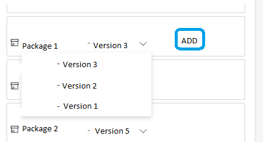
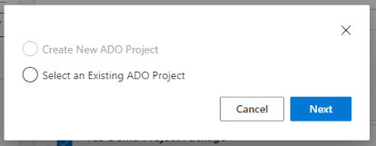
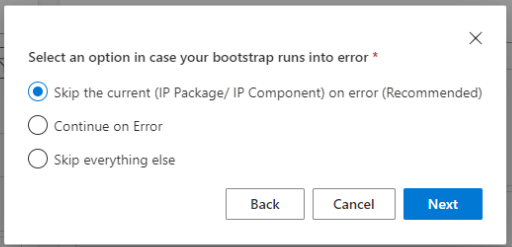

# Engagement Bootstrap List

Once the Engagement id is created using Add Engagement, you can start adding the IP packages and IP components according to your requirement for bootstrapping.

`Note: ` You can add only Active IP Packages and IP Components to the list.

## Add IP Packages and IP Components

Both IP Package and IP Component can be added to an engagement. When you try to add an IP Package to the list, include its associated components.

- Browse to **_[Chrysalis](https://aka.ms/chrysalis)_**, select **Bootstrap** from Assets menu.

- Under **My Engagement tab**, click the next icon.

- Using the filter and search text box, you can select the packages (IP Packages/IP Components) from the **Bootstrap list** tab.

## Engagement Bootstrap

Engagement Bootstrap is used when you have to bootstrap multiple IP Packages or IP Components on one or more target DevOps environments.

## Prerequisites

- Chrysalis Admin, ITSM Admin, or Engagement Bootstrapper can perform bootstrap from the Engagement Details tab.

- Refer **[_PAT permission_](https://aka.ms/PAT-Access)**_ for Bootstrap

## Run Engagement Bootstrap

1. Once you select the Engagement id for Bootstrap, you can start adding the packages (IP Packages/IP Components) from the Bootstrap list tab on the Engagement details page.

2. You can select only Active packages, and when the asset has multiple versions, you can start picking the required Asset version from the dropdown below the package name and click Add.

`Note:` You can see the latest Asset version visible on top of the dropdown list.

3. You can view the list of IP Packages and IP Components added to the selected Engagement id in the right pane.

4. Click the **Bootstrap** button.

`Note:`   

- You cannot perform the Bootstrap process if you have already bootstrapped the existing list of packages under the selected Engagement id. 

- The bootstrap button will be visible only to Engagement Bootstrapper, ITSM Admin, and Chrysalis Admin.

5. Once the Bootstrap button is clicked, choose **"Select an Existing ADO Project"** and click the **Next** button.

6. Enter Target DevOps URL in **URL** box.

7. Enter Target DevOps PAT in **PAT** box.

8. Click the **Next** button.

9. When your Bootstrap runs into an error, select the required option as described below and click the **Next** button.

- **Skip the current (IP Package/ IP Component) on error :**
    This is a recommended option. Selecting this will skip the IP package/component for which an error occurs and continue running the next packages/components.

- **Continue on Error**: This option will continue running the package/components along with any error.

- **Skip everything else**: use this option to skip and stop bootstrapping when the first error occurs.

10. Once the bootstrap is complete, you can view the bootstrap id details under the [**_Bootstrap History_**](https://aka.ms/Bootstrap-History-tab) tab.

11. On the Engagement Details page, search for the active IP packages using the search text box on the left panel.

12. Select the required IP Package or IP Component from the **Bootstrap list** tab and click the **Add** button.

`Note:` 

- You can keep adding the IP packages and IP components newly to the existing list and proceed with the bootstrap process.

- Once you add the required IP Packages and IP Components to the list, save the list and click the Bootstrap button.

- If any deprecated asset exists in an engagement id, it will be stroked off from the saved list, and when you try to perform Bootstrap, you will see a message: "The deprecated asset will not be bootstrapped."

- If an asset is being added to an engagement id in the saved status and when the asset is deleted, you can see the deleted asset stroked off from the saved list under the engagement id.

- When you try to bootstrap the engagement id with the deleted assets in the list, you will see the message: "The deleted asset will not be bootstrapped."

- You can add new package having no enablers but has associated components to an Engagement id and perform Bootstrap. However, the associated components added must be extracted and in Active status.

## Removing the existing IP Packages and IP Components

 - You can use the checkbox to select or deselect the packages and run the Bootstrap process only for the selected list. 

- if you want to uncheck one of the IP Packages and IP Components from the list, you can remove the component and perform Bootstrap with the remaining packages alone.

- You can also add the unchecked IP packages and IP components using the **_Add_** link next to the asset title in the right pane.

`Note:` The unchecked and removed packages or components will appear strike-off in the right pane.

## Status of the Engagement Id 

### Partially Bootstrapped

You can remove existing or add new Components or Packages to an engagement id and perform Bootstrap. 

When you exclude existing Components or Packages of an engagement id, then after Bootstrap, you can see the status of the engagement id a - **_Partially Bootstrapped._** 

### Bootstrapped

When you Bootstrap the entire engagement id list, you can see the status as - **_Bootstrapped._**

### In-progress

Once you click the Bootstrap button from the selected engagement id, then you can see the status as **_In-progress._**

### Saved

When you have added the required Components or Packages to an engagement id and have not performed any Bootstrap but only saved the list, you will see the status as **_Saved_**.

### Failed

When the Bootstrap fails to complete successfully, you can see the status as **_Failed._**
