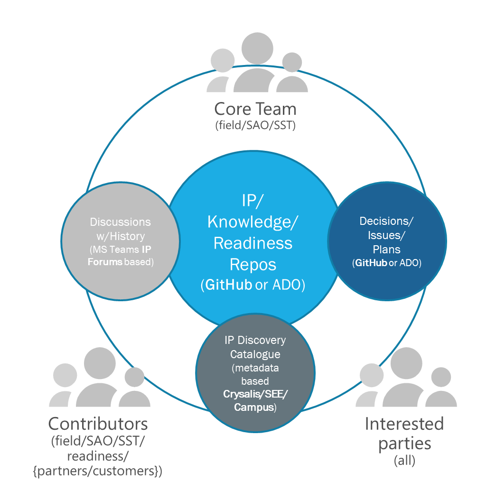

# Team Model

Team model for the evergreen delivery IP based IP or incubation project is based on the principles of innersource core teams. This page provides more details about the model and main "tools" that the team is leveraging when working on the IP.

## Model

The model schematically is shown in the image below.

Image shows three main groups of contributors/users of IP:

- **core team** that consists of the key team members accountable for the IP development and maintenance over time, welcoming external contributors, defining goals and planning the IP evolution based on the needs of customers, issues submitted. In broader [innersource](../resources/innersource.md) community this group of team members are also called "Trusted Contributors".
- **contributors** that are other Microsoft (or with time even partner and customer representatives involved in co-innovation) that are contributing to various aspects of the IP - documentation, components, issues etc. Contributors can over time become core team members.
- **interested parties** that are reusing the IP, providing feedback and over time can become contributors and core team members

## Lifecycle

The typical progression/lifecycle of the team working on an IP asset includes these steps:

1. Starts with the core team (can be field team or SAO team) that wants to capture assets
1. Team creates an IP repository and associated IP forum with predefined starter structure and metadata
1. Metadata drives discovery of the IP in existing and upcoming platforms – [SEE, Chrysalis](../resources/tools.md)
1. Interested parties start to discover IP and as it becomes more popular, contributions grow, contributor and core team grows

## Tools

The IP team relies on three main sets of tools to manage the IP and process around IP evolution:

- **Core repository** that contains structured IP content in a version controlled environment (GitHub/ADO). This environment is also used for public discussions, tracking issues, plans (backlog)
- **Discussions** that are used to have meetings and informal information exchange that can be private within core team or public to address entire set of contributors and interested parties. This environment is leveraging MS Teams as the base platform and  private channels concept to ensure certain discussions remain scoped at core team only. SharePoint site associated with Teams can also be used to manage binary IP assets that are not supported well in Git based repositories.
- **IP Discovery Catalogue(s)** that are used as the means of discovery of IP. They can be reactive (like Campus) where users need to search for repos/IP they are interested or proactive (as SEE) that provides IP based suggestions based on opportunities/projects users are engaged in. The approach ensures that over time more catalogues and publishing tools can be added without affecting the core team's work.
