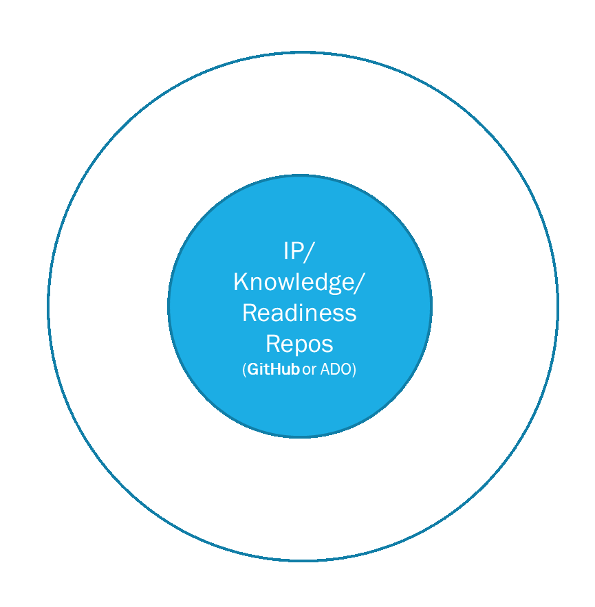

# Diverse Delivery IP

ACAI domain teams work on different IP assets that can range from documentation of processes to scripts and code components that are used in deploying customer solutions. Due to this variety of different assets, one size (approach) cannot fit all teams.

Also it is important that existing assets that have built some time ago can gradually be on-boarded and start benefitting from evergreen delivery IP elements over time.

To ensure this flexibility and modularity of the approach, also allow to start small and grow as IP grows, the evergreen delivery IP introduces concept of content lenses. More on principles, examples of lenses and how it helps overall approach see more in subsections below.

## Principles & Process

- The first thing that any IP repository needs is to have **readme** and **contribution** guideline files, and the main **evergreen IP metadata file** describing the project/IP, its team, contribution rules. This already should help potential contributors to find the repository, understand the goal of the project and start reusing, over time contributing back.
- As repository grows and specific additional types of content get deliver, core team behind the IP can decide to commit to certain type of content to be added, for example, to add easy to consume documentation about the IP, APIs it exposes (if this is a component being implemented) etc.
  - This is achieved through "content **lenses**" to ensure that there is a unified approach on how different types of IP assets get managed and described in ACAI.
  - Each lense defines its specific approach for content and metadata describing this content, each lens as part of Evergreen Delivery IP can come with guidance on how to implement it, tools providing additional value. For example, documentation lens defines includes guidance on content authoring, publishing as part of MS Internal site, has Azure pipeline assets to support implementation.

Illustration of starting with base repo and then adding in more lenses depending on type of assets managed in the repo is provided below.

## Examples of Lenses

Lenses require additional predefined BOM per type, can enable tools and additional guidance (these BOM items are owned by respective team, Evergreen Delivery IP program only helps with tooling and approach):

- Documentation - documentation lens is helpful for projects that document best practices, patterns, approaches, methodology etc.
- Reference architecture - reference architecture lens includes specific assets on top of general documentation lens to include specific BOM items that are helpful when defining reference architecture, also the metadata associated with reference architecture can help ling it to various services used in architecture, industries etc.
- IP Component (as per [IP component framework](http://aka.ms/components)) - defines that repository IP included supports IP components and therefore all the BOM items that component framework requires to be supported, e.g, component specification, SOW fragments
- Readiness - if repo supports readiness it includes a standardized way of linking to readiness materials for the IP being developed or readiness content being captured. For example, repo sources themselves could have more readiness content source material while lens can point to Readiness Board
- Offering - offering itself is not necessarily part of repository, but delivery IP in repository could support one or more offerings. This lense enables standard way to define the offerings that the delivery IP in repository supports
- Customer Questionnaire (to help scope) - some of the offerings in ACAI have leveraged structured questionnaires to get insights into the scope of upcoming engagement. This can be another example of lense that repository can commit to having to support sales of the IP being developed by the team.
- ... - there can be other types of assets - the goal of Evergreen Delivery IP is to implement support for the most common and allow also extended MCS teams to contribute back new lens content for specific IP types these teams are leveraging.

## Becoming Evergreen

If you want to start implementing these principles into your IP work - teams and repositories, please see [Getting Started](../guidance/index.md) in Guidance section.
