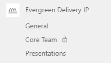

# Collaboration Site

An important aspect of any IP team is collaboration that goes beyond just pull request and issue information tracked in teh [repositories](./repo.md). There is a need for space for more informal discussions, for binary documentation that is not the best for structured source control environments like Git and for supporting remote meetings. This is achieved through IP team Team sites.

The general approach for Teams site reuse the learnings and approaches from experience of teams running IP Forums and DevOps DoJo. As described in the [Approach Section under Team Model](../../approach/Team-model.md), there is a single site per the logical IP asset being worked on by a single Core contributor team. Note that if IP Asset is quite large, e.g., microservices based application that is built up of multiple services each residing in its own Git repository, then this single collaboration site is linked from multiple repos.

## Naming the Collaboration Space

Name of the Teams team that is used as the collaboration site must represent the IP asset being worked on. If this is asset is an "e-invoicing solution for tax authorities" then "e-invoicing", "e-invoicing solution" would be good examples of the names to be chosen.

## Team Owners

Core Team members need to be made owners of the Team site. As per Microsoft policies, this means that each IP team consists of at least 2 core team members.

## Access Rights

Given Evergreen follows innersource principles, by default it is suggested that the Team is set up with public access for all Microsoft employees. This means that general channel and other default channels added would be visible to all users who want to join and learn or contribute.

To ensure Core team (trusted contributors) have their own private space for discussions, Core Team private channel with access granted to the Core team members can be created. All files, OneNote notes and other assets in this protected channel would be visible only to core team members.

> [!Note]
> The only downside of this approach is that Teams currently does not allow meetings scheduled inside of the Teams private channels. If meetings cannot be kept open for entire community to join, suggestion is to use Meet Now or schedule recurring Teams calls outside of the channel. We hope this feature gets added in Teams soon to remove even this annoyance (aka ['evergiven'](https://en.wikipedia.org/wiki/Ever_Given#/media/File:Container_Ship_'Ever_Given'_stuck_in_the_Suez_Canal,_Egypt_-_March_24th,_2021_cropped.jpg)).

## Linking Other Content Into Teams Site

To ensure efficient visibility into the teams work and work results, metrics, it is suggested that Teams site general channel and/or core team's private channel has additional tabs added, for example, to include:

- **team dashboard from ADO** showing the current work in progress or current issues list directly in Teams environment
- **[documentation lens](../documentation-lens/index.md)** web site if it is part of the IP asset
- **metrics dashboard** showing important internal and external metrics team is tracking

## Reusing Content

The binary content like PowerPoint files can be hosted in the [documentation web site](../documentation-lens/index.md) through embedding via shared embed link. This enables common use of content from structured repositories of the IP and the collaboration site. When sharing the content from collaboration site via embedding, please ensure that this is shared from the public part of the site available to all MS employees.

This is an example of Evergreen Delivery IP overview deck exposed from the IP collaboration site:

<iframe src="https://microsofteur.sharepoint.com/teams/EvergreenDeliveryIP/_layouts/15/Doc.aspx?sourcedoc={0686c313-298c-4944-88d6-4654d3a1eb90}&amp;action=embedview&amp;wdAr=1.7777777777777777" width="610px" height="367px" frameborder="0">This is an embedded <a target="_blank" href="https://office.com">Microsoft Office</a> presentation, powered by <a target="_blank" href="https://office.com/webapps">Office</a>.</iframe>

## Example

[MS Teams team of the Evergreen Delivery IP guidance](https://teams.microsoft.com/l/team/19%3a3d51464fa01345f6a79290ac257ead8c%40thread.tacv2/conversations?groupId=ef3294c6-f026-47a2-842e-1881f6f09272&tenantId=72f988bf-86f1-41af-91ab-2d7cd011db47) used for collaboration with broader community and enabling private communication of the core team.

Example of the structure of a simple collaboration site is shown in the screenshot below. It contains general channel for communication with broader community, dedicated public presentations channel where presentations content gets stored and protected channel for the core team to communicate.

Note that team can decide to create new public or private channels as per needs of the team to ensure structured and well managed collaboration environment.

