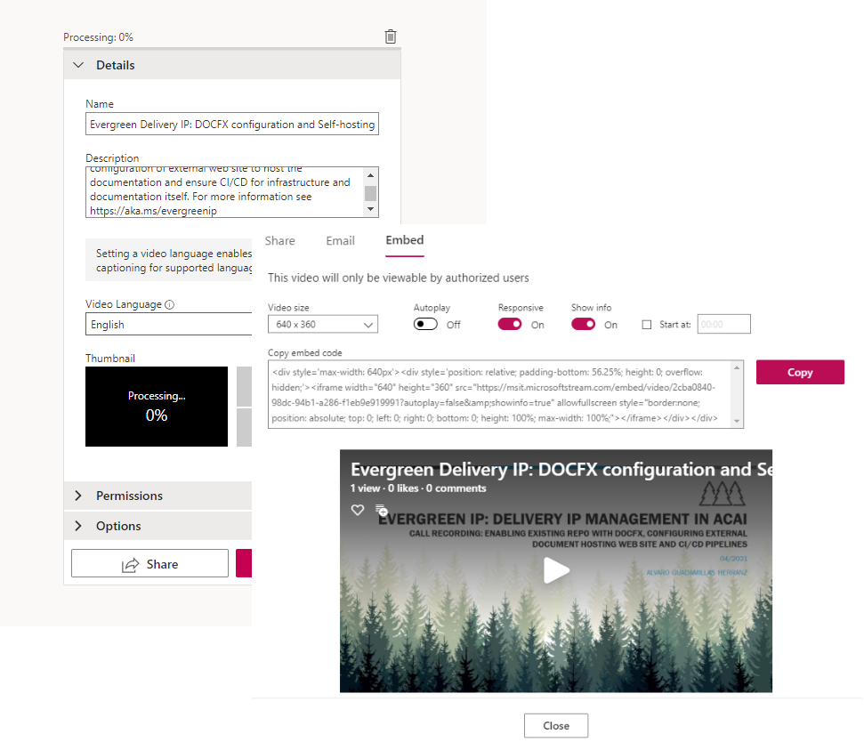
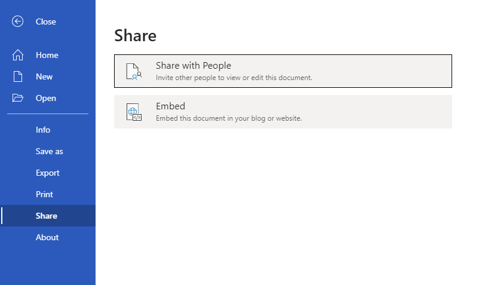
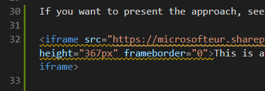

# Document Authoring Guidance

This pages contains additional guidance on managing the structure of DOCFX compliant documentation site, tips/tricks that might be useful for those maintaining the documentation.

## Source Documentation Structure

In addition to main document lens metadata file [`evergreen-docs.yml`](./evergreen-docs-content.md) DOCFX requires additional files and certain document structure to be used. The main elements to pay attention to when implementing own documentation site are:

- all the content of the site is stored under `/docs` (can be changed, but this is the suggested location)
- DOCFX main configuration file used to build the static site stored in `/docfx.json` (see [docfx.json example](https://dev.azure.com/evergreen-delivery-ip/_git/docs?path=%2Fdocfx.json&version=GBmain))
- have optional `/docfx/templates/<yourtemplatename>` folder where files overriding the template are located (if template is overridden)

The typical structure of the documentation section of the IP asset would typically have this guidance:

```
|-- / (root)
    |-- docs
    |     |-- index.md
    |     |-- <other page>.md
    |     |-- toc.yml
    |     |-- <subfolder>
    |     |      |-- index.md
    |     |      |-- <other page>.md
    |     |      |-- toc.yml
    |-- docfx/templates/<my project name>
    |     |-- favicon.ico
    |     |-- logo.svg
    |-- docfx.json
    |-- evergreen-docs.yml
```

## Generating Site Locally

When working with documentation it is useful to generate it locally, validate via http://localhost:8080 that is the default hosting environment for local documentation site. To be able to process the source files into static site, `docfx` command line tool needs to be [downloaded](https://github.com/dotnet/docfx/releases), unzipped and added to PATH.

The command line `docfx .\docfx.json -o "_docfxsite" --serve` is used to generate the site and server in on localhost:8080.

To ensure that the generated site HTML and other content files are not checked back into the source control, please update your `.gitignore` to include the `_docfxsite` location.

More information on using DOCFX tools: [DocFX command-line](https://dotnet.github.io/docfx/tutorial/docfx_getting_started.html#2-use-docfx-as-a-command-line-tool), [Docfx commands](https://dotnet.github.io/docfx/tutorial/docfx.exe_user_manual.html#2-commands).

## Site Structure and Menus

Top menu and side menu for the site can be created using toc.yml files as part of the overall documentation content definition. More information on the TOC file contents you can find in the [DOCFX documentation on TOC creation](https://dotnet.github.io/docfx/tutorial/intro_toc.html).

Examples of the TOC files:

- for this site covering [main menu](https://dev.azure.com/evergreen-delivery-ip/_git/docs?path=%2Fdocs%2Ftoc.yml),
- for this site's one of hte [second level menus](https://dev.azure.com/evergreen-delivery-ip/_git/docs?path=%2Fdocs%2Fguidance%2Ftoc.yml).

## Customizing Look and Feel

Probably the simples way to customize look and feel of the documentation site generated using DOCFX is to export the default template, find the files to be modifies and replace them in a custom location that is referenced from `docfx.json` file.

More details on exporting default template, defining new location for the override files are provided in [DOCFX tutorials](https://dotnet.github.io/docfx/tutorial/howto_create_custom_template.html#merge-template-with-default-template).

Example of one of a minimal update is [shown as part of this site](https://dev.azure.com/evergreen-delivery-ip/_git/docs?path=%2Fdocfx%2Ftemplates%2Fegip) where only favicon and main site icon are replaced with customized versions.

## Embedding Resources

Markdown allows using links to link external resources hosted on the web. For binary content like YouTube Videos, PowerPoint presentations, for example, it is suggested to host it as part of the web site in embedded format.

### Internal Video

Embedding a video about the IP, its use or contribution approaches is suggested through the [Microsoft Steam](https://msit.microsoftstream.com/). The video can be uploaded under the IP team group's videos collection an shared out.

Image below shows the metadata being entered during upload of the video to Microsoft Stream and embed link being retrieved to use it in documentation website.



The `div` content copied from the sharing as embedded screen needs to be added directly into the markdown. See [the guidance page for deploying the site](./self-hosted-site.md) showing how embedding of internal video works. It is suggested to extract the embedding link as responsive so it fills the entire width of the content area.

### Documents

Embedding Word or PowerPoint requires opening the PowerPoint or Word document in On-line version of the app, choosing Share -> Embed and copying the embed `iframe` code to the markdown file directly. Image below shows Word UI used to request embedding link.



Following image shows link embedded directly into DOCFX markdown content file.



### External Video

For more information about embedding external YouTube video see [DOCFX Favored Markdown description](https://dotnet.github.io/docfx/spec/docfx_flavored_markdown.html#video).
