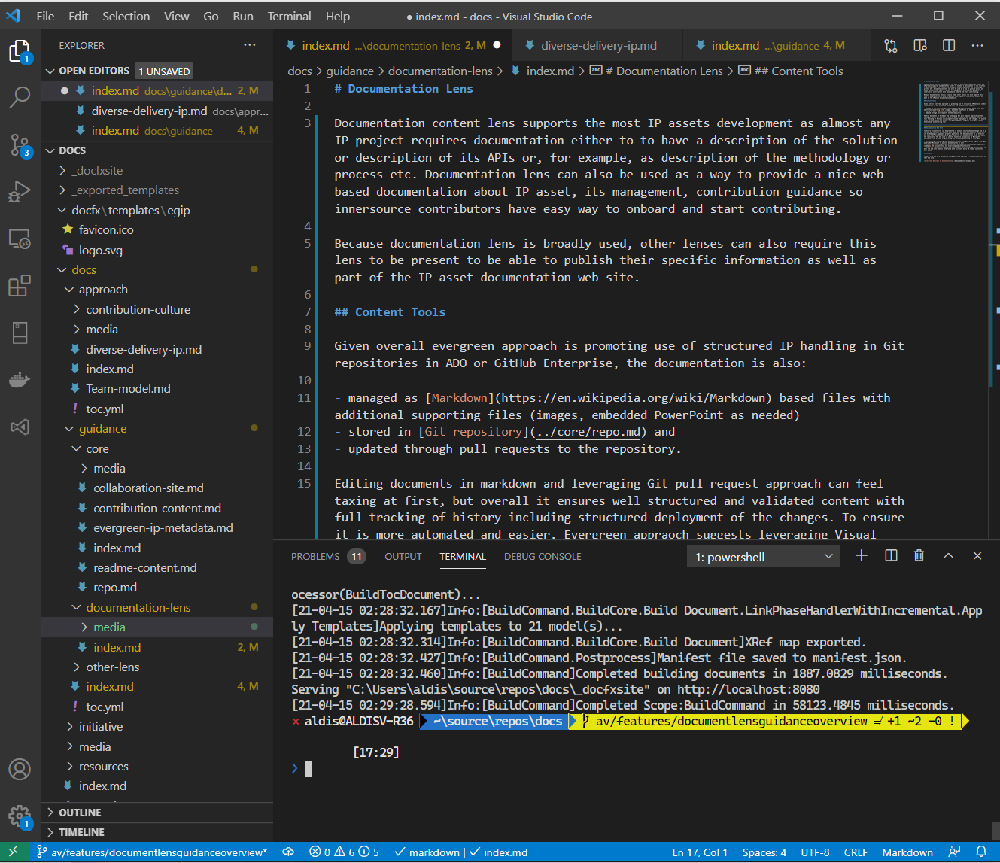
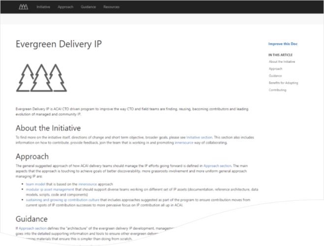

# Documentation Lens

Documentation content lens supports the most IP assets development as almost any IP project requires documentation either to to have a description of the solution or description of its APIs or, for example, as description of the methodology or process etc. Documentation lens can also be used as a way to provide a nice web based documentation about IP asset, its management, contribution guidance so innersource contributors have easy way to onboard and start contributing.

Because documentation lens is broadly used, other lenses can also require this lens to be present to be able to publish their specific information as well as part of the IP asset documentation web site.

## Content Tools

Given overall evergreen approach is promoting use of structured IP handling in Git repositories in ADO or GitHub Enterprise, the documentation is also:

- managed as [Markdown](https://en.wikipedia.org/wiki/Markdown) based files with additional supporting files (images, embedded PowerPoint as needed)
- stored in [Git repository](../core/repo.md),
- updated through pull requests to the repository,
- converted into published version using [DOCFX](https://dotnet.github.io/docfx/) static site generation engine leveraged my broader Microsoft to publish documentation as well.

Editing documents in markdown and leveraging Git pull request approach can feel taxing at first, but overall it ensures well structured and validated content with full tracking of history including structured deployment of the changes. To ensure it is more automated and easier, Evergreen approach suggests leveraging Visual Studio Code as the authoring tool.

Example of VS Code being used to edit this page is shown in the image below. Suggested plug-ins to enable easy VS Code authoring of documents are:

- Code Spell Checker extension
- Markdown All in One extension
- MarkdownLint extension

## Content Structure and Metadata

Each content lens needs to have its metadata file that provides additional content type specific information that indexing tools can capture and use in linking to other assets, more detailed processing etc.

Documentation lens requires [`evergreen-docs.yml`](evergreen-docs-content.md) metadata file that is linked from the main metadata file of the evergreen repo. The metadata file contains main the details about the documentation managed in repo, points to the publishing site location.

In addition to metadata file there are other requirements and suggestions around the structure of DOXFX document content site. For more guidance on best practices authoring content as per DOCFX guidance see [Document Authoring using DOCFX](document-authoring.md).

## Documentation Web Site

To ensure documentation can be presented in an easy to consume way though and in a unified way (without differences when teams use ADO with its Wikis vs GitHub with its GitHub pages), approach promotes publishing the documentation on an external web site that gets automatically generated from the documentation source file, content structure guidance files, template override files as per DOCFX stored in the Git repository. The web site is secured to ensure only access by Microsoft employees.

Hosting of the generated web site is planned to be possible in two ways:

- [**self-hosted site**](#self-hosted-site) where team hosts it in their own Azure subscription,
- [**centrally hosted site**](#centrally-hosted-site) where centralized tools that index the evergreen sites see all sites with Documentation lens in them and on a regular basis compile and host the web site centrally.

### Self-hosted Site

The process of generating web site and publishing it by the team itself leverages:

- [Azure Pipelines](https://azure.microsoft.com/en-us/services/devops/pipelines/) to deploy the documentation and underlying web infrastructure
- [Azure Web Apps](https://azure.microsoft.com/en-us/services/app-service/web/) to host the web site that is integrated with Microsoft Azure AD tenant to control user access

The approach provides the most flexibility of deployment, use of any custom website name, leveraging all features of Azure Web Sites that team can configure as they are responsible for it. On the other hand this approach requires own subscription to pay for the hosted web site and configuration of CI/CD templates as per guidance on this site (should take approximately 2 hours to set it up).

This approach of hosting the site is fully supported and there are example pipelines for infrastructure provisioning and site deployment that can be used as examples to start implement the hosting process.

See more and get ready-made templates to help with implementing self-hosted documentation site in [Self-hosted Site](./self-hosted-site.md) page.

### Centrally Hosted Site

Benefit of centrally hosted documentation site is that IP team needs only to document the site using [DOCFX guidance](https://dotnet.github.io/docfx/tutorial/docfx_getting_started.html), ensure it is properly described in [`evergreen-docs.yml`](evergreen-docs-content.md) and external documentation publisher tool on a regular basis (or based on trigger) gets the updated content and publishes it.

The approach is more restricted from the point of view of the flexibility, yet it does not require own additional configuration of deployment pipelines, web sites and does not require own Azure Subscription.

Given this approach requires build-out of the centralized infrastructure to support it, this hosting option is currently not yet available (work in progress).

## Example

Example of a web site maintained using described approach of documentation lens is this web site.

