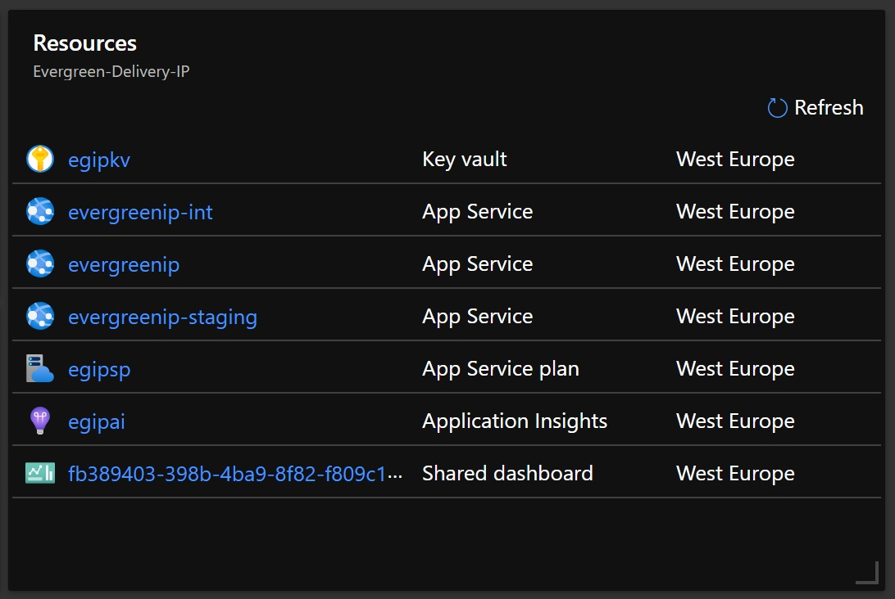
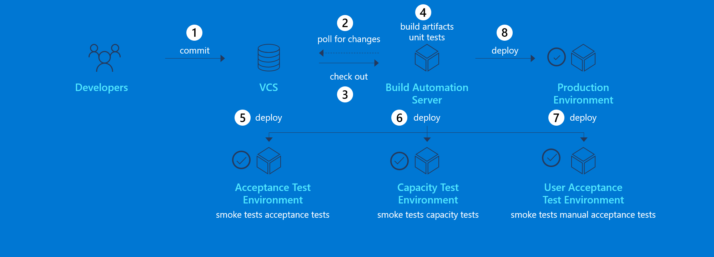
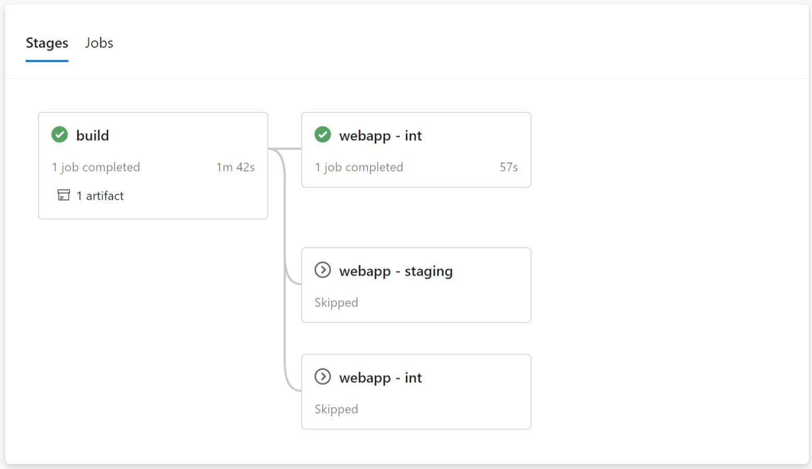
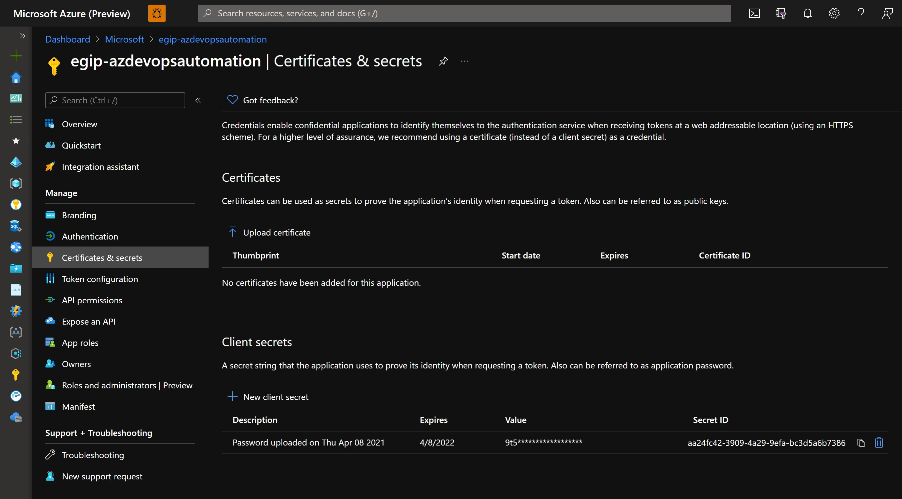

# Self-hosted Documentation Site

Page provides information on the approach of implementing the Self-hosted Documentation Site. Self-hosted documentation hosting is one of the options of hosting as per the [documentation lens approach](index.md) defined.

Self-hosting provides the most flexibility and control, yet requires to use own Azure Subscription to host the documentation website and also needs some more work to set up the pipelines for continuous integration and continuous release of the documentation updates to the web.

There are two elements required for self-hosted documentation sites:

- web server infrastructure integrated with Azure AD of Microsoft hosting the documentation web site, supporting AppInsights as well
- automatic build and deployment of the DOCFX based site using the source files in the repo and pushing them to the web server infrastructure.

The sections below and child sections provide guidance on how to set up Automated Builds ([Continuous Integration](https://devopsdojodocs.azurewebsites.net/white-belt/capabilities/continuous-integration/index.html)) and Automated Deployments ([Continuous Delivery](https://devopsdojodocs.azurewebsites.net/white-belt/capabilities/continuous-delivery/index.html)) for these two elements.

## Branching strategy

Distributed version control systems like Git give you flexibility in how you use version control to share and manage code. A [branching strategy](https://devopsdojodocs.azurewebsites.net/white-belt/capabilities/continuous-integration/branching-strategy.html) should find a balance between this flexibility and the need to **collaborate** and **share code** in a consistent manner.

Adopting an effective branching strategy will help to smoothly collaborate and integrate work frequently to keep the greatest latest content continuously published.

To avoid long-lived branches, we adopt a [Trunk-based development](https://devopsdojodocs.azurewebsites.net/white-belt/capabilities/continuous-integration/trunk-based-branching.html) branching strategy, in which any new change will be proposed in a [feature branch](https://devopsdojodocs.azurewebsites.net/white-belt/capabilities/continuous-integration/branching-strategy.html#feature-branches) that ideally will not live longer than 24 hours (when individuals on a team are committing their changes to the [main branch](https://devopsdojodocs.azurewebsites.net/white-belt/capabilities/continuous-integration/branching-strategy.html#main-branch) multiple times a day, it becomes easy to satisfy the core requirement of Continuous Integration and Continuous Delivery).

| Branch name / naming convention | Purpose | Example
| - | - | - |
| `main` | The default branch, containing the code running in the production environment. Previously, the default branch was almost always named `master` (for more background on this change, this statement from the [Software Freedom Conservancy](https://sfconservancy.org/news/2020/jun/23/gitbranchname/) is an excellent place to look).
| `[user alias]/[description-of-change]` | The feature branch, also known as topic branches. Feature branches isolate work in progress from the completed work in the main branch. Making it short-living will help achieve a faster integration of the changes, a faster review and approval and thus more transparency

## Environments strategy

As with any software, we need a strategy to validate our changes before releasing those changes to production. Even if we have tools to [generate the website locally](../documentation-lens/document-authoring.md#generating-site-locally), the hosting infrastructure of our site will be different, and before releasing the new changes, we might want to add automated tests to every change (e.g. grammar check, length check, accessibility check) and see the results before releasing to production.

Following the "[build once](https://devopsdojodocs.azurewebsites.net/white-belt/capabilities/continuous-delivery/build-once.html)" strategy, the same automated build artifact must be deployed to all environments.

As environments strategy, we recommend having the following environments:

| Name | Purpose | Trigger conditions | Example |
| - | - | - | - |
| Integration | This environment will allow any contributor to see the changes being worked in the contributor branch before event starting a new Pull Request. | Changes to any branch different from `main` will trigger a deployment to this environment | https://evergreenip-int.azurewebsites.net/
| Staging | This environment will allow any approver to see how the site will look in production before approving the Pull Request | Any Pull Request to the `main` branch will trigger a deployment to this environment | https://evergreenip-staging.azurewebsites.net/
| Production | The environment with the approved content publicly - or internally - available to anyone | Changes to the `main` branch will trigger a deployment to this environment | https://evergreenip-staging.azurewebsites.net/

## Infrastructure as Code

To speed up configuration, deployment, maintenance and evolution of the hosting infrastructure, avoid environment configuration drift, and achieve the full discipline of Continuos Delivery, we will manage infrastructure as code leveraging MCS [infra-as-code-source](https://aka.ms/iacs) assets, principles and practices, in concrete:

1. [Pipeline orchestrated](https://dev.azure.com/servicescode/infra-as-code-source/_wiki/wikis/Wiki/3832/Pipeline-orchestrated) deployment
2. [Module](https://dev.azure.com/servicescode/infra-as-code-source/_wiki/wikis/Wiki/3761/Modules) approach for Infrastructure as Code

See guidance on how to structure the infrastructure as code for all the environments of the self-hosted site in the child article [Infrastructure as Code](self-hosted-site/infrastructure-as-code.md)

## Continuos Integration and Continuous Delivery

[Continuous Integration](https://devopsdojodocs.azurewebsites.net/white-belt/capabilities/continuous-integration/index.html) and [Continuous Delivery](https://devopsdojodocs.azurewebsites.net/white-belt/capabilities/continuous-delivery/index.html) for both the site content and the site infrastructure will help bring the following benefits:
1. Enable asynchronous collaboration, parallel development and integration of the work frequently, and verified by an automated build (including test) to detect integration errors as quickly as possible.
2. Publish new updates or features in short cycles, quickly, reliably and at any time, following a repeatable and sustainable process

There are different tools that support implementation of Continuous Integration and Continuous Delivery practices:
1. See guidance on how to implement Continuous Integration and Continuous Delivery leveraging Azure DevOps Graphic User Interface pipelines in the child article [Azure DevOps GUI pipelines](self-hosted-site/azure-devops-gui-pipelines.md)
1. See guidance on how to implement Continuous Integration and Continuous Delivery leveraging Azure DevOps YAML pipelines in the child article [Azure DevOps YAML pipelines](self-hosted-site/azure-devops-yaml-pipelines.md)

## Pre-requisites

### Azure DevOps project

Coming soon...

### Azure subscription

Coming soon...

### Deployment Service Principal

To implement CICD, we will use an Azure Service Principal.

> [!NOTE]
> Follow instructions in article [How to: Use the portal to create an Azure AD application and service principal that can access resources](https://docs.microsoft.com/en-us/azure/active-directory/develop/howto-create-service-principal-portal) to create the AD Application to use for App Service authentication

The Service Principal needs to have the following configuration:

| Setting | Value | Description | Example
| - | - | - | -
| Certificates & Secrets | A secret needs to be configured to allow Azure DevOps deployment pipelines [authenticate with Service Principal Credentials](https://docs.microsoft.com/en-us/powershell/azure/authenticate-azureps?view=azps-6.0.0#sign-in-with-a-service-principal-)

The Service Principal needs to be granted with the following permissions:

- Contributor in the Resource Group or Resource Groups that will used for the hosting infrastructure.
- Create a [Service Connection in Azure DevOps](https://docs.microsoft.com/en-us/azure/devops/pipelines/library/connect-to-azure?view=azure-devops#create-an-azure-resource-manager-service-connection-with-an-existing-service-principal)