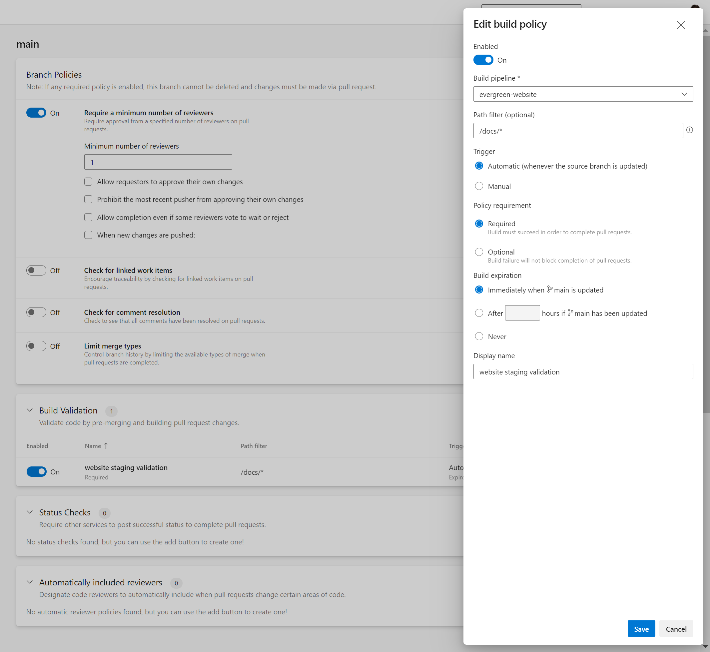
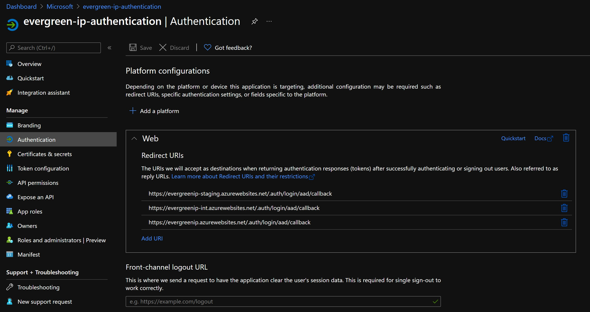
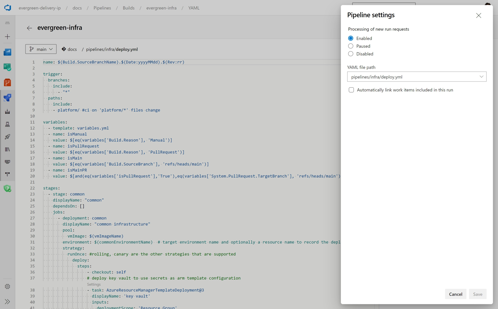
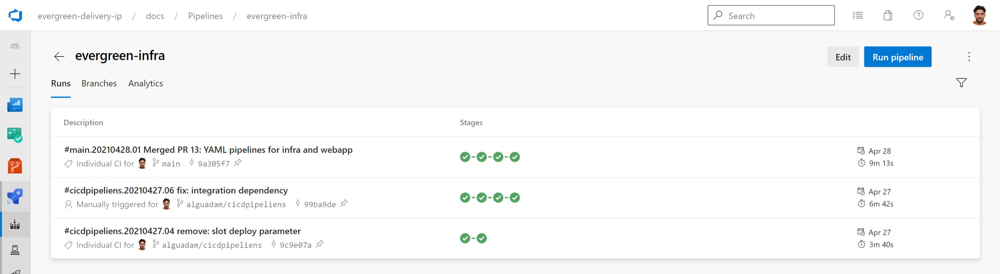
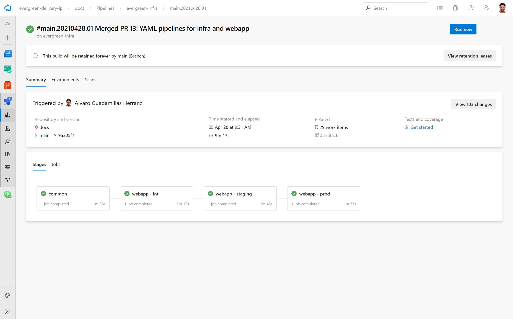

# Overview

This section provides guidance to set-up [Azure DevOps YAML Pipelines](https://docs.microsoft.com/en-us/azure/devops/pipelines/yaml-schema) to configure:

- Continuous Integration and Continouos Delivery of your [hosting infrastructure](#infrastructure-yaml-pipeline).
- Continuous Integration and Continouos Delivery of your [web site](#website-yaml-pipeline).

# Pipelines repository structure

We place all YAML pipeline assets under the `/pipelines` directory of [our repository](https://dev.azure.com/evergreen-delivery-ip/_git/docs?path=%2Fpipelines). The `/platform` directory contains all configuration files for our Infrastructure as Code modules (see [Infrastructure as Code](infrastructure-as-code.md)).

```tree
|-- / (root)
    |-- pipelines/
    |     |-- iacs/
    |     |-- infra/
    |     |   |-- deploy.yml
    |     |   |-- variables.yml
    |     |-- scripts/
    |     |-- website/
    |         |-- deploy.yml
    |         |-- variables.yml
    |-- platform/
```

Where:

- `pipelines/iacs/` directory contains all Infrastructure as Code modules that we will use to deploy our infrastructure. See [Infrastructure as Code](infrastructure-as-code.md).
- `pipelines/infra/` directory contains the YAML pipeline and YAML variables file to implement continuous integration and continuous delivery of the infrastructure. See [Infrastructure Pipeline](#infrastructure-yaml-pipeline)
- `pipelines/scripts/` directory contains scripts that support automation steps for our pipelines
- `pipelines/website/` directory contains the YAML pipeline and YAML variables file to implement continuous integration and continuous delivery of the web site. See [Web Site Pipeline](#website-yaml-pipeline)

# Branch policies

> [!NOTE]
> See our [branch policy configuration for the `main` branch](https://dev.azure.com/evergreen-delivery-ip/docs/_settings/repositories?_a=policiesMid&repo=2b0e335e-1538-47d3-ae6c-2ab4f8cf28f6&refs=refs%2Fheads%2Fmain)

[Branch policies](https://docs.microsoft.com/en-us/azure/devops/repos/git/branch-policies-overview?view=azure-devops) allow to implement the agreed [branching strategy](../self-hosted-site.md#branching-strategy) in any repository and branch.

For our feature branching strategy, we will protect our `main` branch with branch policies to have at least one person from our team review the Pull Request (peer review).

Additionally, we configure the [Website pipeline](#website-yaml-pipeline) as a validation pipeline for every Pull Request to the `main` branch updating files under `docs/` directory. We use this configuration to implement the [environment strategy](../self-hosted-site.md#environments-strategy) and let the Pull Request reviewer use the staging website to validate the proposed changes to the documentation.



# Infrastructure YAML Pipeline

> [!NOTE]
> See our Infrastructure Deployment pipeline: [`pipelines/infra/deploy.yml`](https://dev.azure.com/evergreen-delivery-ip/_git/docs?path=%2Fpipelines%2Finfra%2Fdeploy.yml)

## Infra YAML Pre-requisites

### Azure Active Directory Application for Authentication Configuration

Currently, MSIT AD policy does not allowing Azure AD Service Principals to create other Azure AD Service Principals or Applications, but users can. Given that we will use an Azure AD Application to [enable built-in Azure AD Authentication for App Service](https://docs.microsoft.com/en-us/azure/app-service/configure-authentication-provider-aad), we will need to manually create from the portal the Azure AD Application that we want to use for this.

> [!NOTE]
> Follow instructions in article [Quickstart: Register an application with the Microsoft identity platform](https://docs.microsoft.com/en-us/azure/active-directory/develop/quickstart-register-app#register-an-application) to create the AD Application to use for App Service authentication

The AD Application needs to have the following configuration:

| Setting | Value | Description | Example
| - | - | - | -
| Who can use the application | Accounts in this organizational directory only | Select this option if you're building an application for use only by users (or guests) in your tenant.
| Redirect URIs | `https://[your-production-website-name].azurewebsites.net/.auth/login/aad/callback`<br/><br/>`https://[your-staging-website-name].azurewebsites.net/.auth/login/aad/callback`<br/><br/>`https://[your-integration-website-name].azurewebsites.net/.auth/login/aad/callback` | Redirect URIs are required for Azure AD to redirect the user to the correct URL once authenticated | `https://evergreenip.azurewebsites.net/.auth/login/aad/callback`<br/><br/>`https://evergreenip-staging.azurewebsites.net/.auth/login/aad/callback`<br/><br/>`https://evergreenip-int.azurewebsites.net/.auth/login/aad/callback`
| Select the tokens you would like to be issued by the authorization endpoint | `ID tokens (used for implicit and hybrid flows)` | These tokens will allow to capture id token logs in Application Insights to build the Insights dashboards | 

Example of redirect configuration:



Example of ID tokens and tenant configuration:


## Infra YAML name

> [!NOTE]
> Suggested pipeline name format for detailed tracking: `$(Build.SourceBranchName).$(Date:yyyyMMdd).$(Rev:rr)`

Pipeline name is configured as follows in the YAML pipeline:

```YAML
name: $(Build.SourceBranchName).$(Date:yyyyMMdd).$(Rev:rr)
```

## Infra YAML triggers

[Triggers](https://docs.microsoft.com/en-us/azure/devops/pipelines/build/triggers) allow to run the pipeline automatically under certain conditions.

Pipeline triggers are set as follows in the YAML pipeline:

```YAML
trigger:
  branches:
    include:
      - main
  paths:
    include:
    - platform/ #ci on 'platform/*' files change
```

- The `main` trigger under `branches` will run the pipeline only for commits to the `main` branch.
- The `platform/` trigger under `paths` will run the pipeline on every change to any file under `platform/` path.

Triggers above will allow to run the pipeline automatically on every commit to the `master` branch that affect files under the `platform/` directory, so that only changes to the infrastructure configuration files will trigger the pipeline.

## Infra YAML variables

Variables can be [defined in one YAML file](https://docs.microsoft.com/oen-us/azure/devops/pipelines/process/templates?view=azure-devops#variable-reuse) and then imported in another pipeline. We leverage this strategy to allow for portability and reusability of the deployment pipeline.

> [!NOTE]
> See our pipeline variables file: [`pipelines/infra/variables.yml`](https://dev.azure.com/evergreen-delivery-ip/_git/docs?path=%2Fpipelines%2Finfra%2Fvariables.yml)

The following variables will be loaded from `variables.yml` file during pipeline execution:

```YAML
variables:
  # pipeline config
  azureRMServiceConnection: 'Evergreen-Delivery-IP' # The ADO Service Connection to be used for the deployment
  subscriptionId: '4d186e10-e0a0-4555-a97f-7c8c2272d741' #T he subscription ID where Infrastructure will be deployed
  vmImageName: 'ubuntu-latest'  # Agent VM image name
  System.Debug: true # View pipeline logs
  configFilesPath: '$(Build.SourcesDirectory)/platform' # Path to platform IaC configuration files
  iacsTemplatesPath: '$(Build.SourcesDirectory)/pipelines/iacs' # Path to IaC modules path
  keyVaultTemplateFilePath: '$(iacsTemplatesPath)/key-vault.json' # Path to Key Vault module deployment template file
  applicationInsightsTemplateFilePath: '$(iacsTemplatesPath)/application-insights.json' #  Path to Application Insights module deployment template file
  appServicePlanWindowsTemplateFilePath: '$(iacsTemplatesPath)/app-service-plan-windows.json' # Path to Windows App Service Plan module deployment template file
  appServiceWindowsTemplateFilePath: '$(iacsTemplatesPath)/app-service-windows.json' # Path to Windows App Service module deployment template file
  
  # environment config
  configKeyVaultName: 'egipkv' # Name of the Key Vault used to store configuration variables
  resourceGroupName: 'Evergreen-Delivery-IP' # Name of the Resource Group where the infrastructure will be deployed
  resourceGroupLocation: 'West Europe' # Location of the Resource Group where the infrastructure will be deployed
  
  # common
  commonEnvironmentName: '$(resourceGroupName)-common' # Name given to the Azure pipelines deployment environment with deployment steps for the common hosting infrastructure elements, listed below
  configFilePathKeyVault: '$(configFilesPath)/common/egipkv.json' # Path to the Key Vault configuration file used to store configuration variables
  configFilePathApplicationInsights: '$(configFilesPath)/common/egipai.json' # Path to the Application Insights configuration file used to capture web site logs
  configFilePathAppServicePlanWindows: '$(configFilesPath)/common/egipsp.json' # Path to the Windows App Service Plan configuration file used to host the App Services for all environments

  # int
  intEnvironmentName: 'infra-$(resourceGroupName)-int' # Name given to the Azure pipelines deployment environment with deployment steps for the integration hosting infrastructure elements, listed below
  intConfigFilePathAppServiceWindows: '$(configFilesPath)/int/evergreenip-int.json' # Path to the Windows App Service configuration file used to host the web app for the integration environment

  # staging
  stagingEnvironmentName: 'infra-$(resourceGroupName)-staging' # Name given to the Azure pipelines deployment environment with deployment steps for the staging hosting infrastructure elements, listed below
  stagingConfigFilePathAppServiceWindows: '$(configFilesPath)/staging/evergreenip-staging.json' # Path to the Windows App Service configuration file used to host the web app for the staging environment

  # prod
  prodEnvironmentName: 'infra-(resourceGroupName)-prod' # Name given to the Azure pipelines deployment environment with deployment steps for the production hosting infrastructure elements, listed below
  prodConfigFilePathAppServiceWindows: '$(configFilesPath)/prod/evergreenip.json' # Path to the Windows App Service configuration file used to host the web app for the production environment
```

Pipeline variables are configured as follows in the YAML pipeline:

```YAML
variables:
  - template: variables.yml
  - name: isManual
    value: $[eq(variables['Build.Reason'], 'Manual')]
  - name: isPullRequest
    value: $[eq(variables['Build.Reason'], 'PullRequest')]
  - name: isMain
    value: $[eq(variables['Build.SourceBranch'], 'refs/heads/main')]
  - name: isMainPR
    value: $[and(eq(variables['isPullRequest'],'True'),eq(variables['System.PullRequest.TargetBranch'], 'refs/heads/main'))]
```

Additionally, the following variables calculated at run time are added:

- `isManual`: `true` if the event that caused the build to run is a manual user trigger, `false` otherwise.
- `isPullRequest`: `true` if the event that caused the build to run is a Git branch policy that requires a build to run, `false` otherwise
- `isMain`: `true` if the source branch is `refs/head/main`, `false` otherwise. Used as condition to run deployment steps only when there is a change in the main branch.
- `isMainPR`: `true` if the target branch is `refs/head/main` and the `isPullRequest` condition is met , `false` otherwise. Used as condition to run deployment steps only when there is a Pull Request to the main branch.

## Infra YAML build steps

No build steps will be executed  for Infrastructure deployment. Build steps are included in the IaC modules creation to validate the quality of the IaC modules. See [How to create a Module?](https://dev.azure.com/servicescode/infra-as-code-source/_wiki/wikis/Wiki/3762/Create-Module) in IaCS.

## Infra YAML deployment steps

The deployment steps will allow deploy the Infrastructure elements to Azure for all the environments. The strategy to follow for the deployment is:

- Each environment will be deployed in its own [stage](https://docs.microsoft.com/en-us/azure/devops/pipelines/process/stages?view=azure-devops&tabs=yaml)
- Each stage will use [deployment jobs](https://docs.microsoft.com/en-us/azure/devops/pipelines/process/deployment-jobs?view=azure-devops) to orchestrate the deployment
- Certain configuration will be generated at deployment time and cannot be predicted beforehand (e.g. Application Insights Instrumentation Key) and needs to be reused in future deployment jobs. Two strategies can be followed:
  - Define task [output variables](https://docs.microsoft.com/en-us/azure/devops/pipelines/process/variables?view=azure-devops&tabs=yaml%2Cbatch#use-output-variables-from-tasks) and use those variables to replace the values of the configuration files (using tasks such as [Replace Tokens](https://marketplace.visualstudio.com/items?itemName=qetza.replacetokens)).
  - Leverage Azure Key Vault in the ARM Template to store the required configuration as Key Vault [secrets](https://docs.microsoft.com/en-us/azure/templates/microsoft.keyvault/vaults/secrets?tabs=json) that can be reused by other ARM Templates via [ARM Template secret references](https://docs.microsoft.com/en-us/azure/azure-resource-manager/templates/key-vault-parameter?tabs=azure-cli#reference-secrets-with-static-id)

### Common infra stage

Steps to deploy the common infrastructure are configured as follows in the YAML pipeline:

```YAML
stages:
  - stage: common
    displayName: "common"
    dependsOn: []
    jobs:
      - deployment: common
        displayName: "common infrastructure"
        pool:
          vmImage: $(vmImageName)
        environment: $(commonEnvironmentName)  # target environment name and optionally a resource name to record the deployment history; format: <environment-name>.<resource-name>
        strategy:
          runOnce: #rolling, canary are the other strategies that are supported
            deploy:
              steps:
                  - checkout: self
                  # deploy key vault to use secrets as arm template configuration
                  - task: AzureResourceManagerTemplateDeployment@3
                    displayName: 'key vault'
                    inputs:
                      deploymentScope: 'Resource Group'
                      azureResourceManagerConnection: $(azureRMServiceConnection)
                      subscriptionId: $(subscriptionId)
                      action: 'Create Or Update Resource Group'
                      resourceGroupName: $(resourceGroupName)
                      location: $(resourceGroupLocation)
                      templateLocation: 'Linked artifact'
                      csmFile: '$(keyVaultTemplateFilePath)'
                      csmParametersFile: '$(configFilePathKeyVault)'
                      deploymentMode: 'Incremental'
                      deploymentOutputs: 'OUTPUTS_KEYVAULT'
                      pwsh: true
                  # deploy application insights
                  - task: AzureResourceManagerTemplateDeployment@3
                    displayName: 'application insights'
                    inputs:
                      deploymentScope: 'Resource Group'
                      azureResourceManagerConnection: $(azureRMServiceConnection)
                      subscriptionId: $(subscriptionId)
                      action: 'Create Or Update Resource Group'
                      resourceGroupName: $(resourceGroupName)
                      location: $(resourceGroupLocation)
                      templateLocation: 'Linked artifact'
                      csmFile: '$(applicationInsightsTemplateFilePath)'
                      csmParametersFile: '$(configFilePathApplicationInsights)'
                      deploymentMode: 'Incremental'
                      deploymentOutputs: 'OUTPUTS_APPLICATIONINSIGHTS'
                      pwsh: true
                  # deploy windows app service plan
                  - task: AzureResourceManagerTemplateDeployment@3
                    displayName: 'windows asp'
                    inputs:
                      deploymentScope: "Resource Group"
                      azureResourceManagerConnection: $(azureRMServiceConnection)
                      subscriptionId: $(subscriptionId)
                      action: "Create Or Update Resource Group"
                      resourceGroupName: "$(resourceGroupName)"
                      location: $(resourceGroupLocation)
                      templateLocation: "Linked artifact"
                      csmFile: "$(appServicePlanWindowsTemplateFilePath)"
                      csmParametersFile: "$(configFilePathAppServicePlanWindows)"
                      deploymentMode: "Incremental"
                      deploymentOutputs: "OUTPUTS_APPSERVICEPLANWINDOWS"
```

These deployment steps will deploy the following Azure Infrastructure:

- Key Vault to be used as configuration store
- Application insights to be used to capture metrics and monitoring. The instrumentation key will be stored as a secret in the Key Vault above
- Windows App Service Plan to host all the App Services

Because no conditions have been added to this stage, it will be executed every time the pipeline is triggered (via [triggers configuration](#infra-yaml-triggers) or manually)

### Integration infra stage

Steps to deploy the integration infrastructure are configured as follows in the YAML pipeline:

```YAML
  - stage: integration
    dependsOn:
    - common
    displayName: "webapp - int"
    jobs:
      - deployment: int
        displayName: "deploy windows webapp"
        pool:
          vmImage: $(vmImageName)
        environment: $(intEnvironmentName)  # target environment name and optionally a resource name to record the deployment history; format: <environment-name>.<resource-name>
        strategy:
          runOnce:    #rolling, canary are the other strategies that are supported
            deploy:
              steps:
                - checkout: self
                # deploy linux web app
                - task: AzureResourceManagerTemplateDeployment@3
                  displayName: 'app service'
                  inputs:
                    deploymentScope: 'Resource Group'
                    azureResourceManagerConnection: $(azureRMServiceConnection)
                    subscriptionId: $(subscriptionId)
                    action: 'Create Or Update Resource Group'
                    resourceGroupName: $(resourceGroupName)
                    location: $(resourceGroupLocation)
                    templateLocation: 'Linked artifact'
                    csmFile: '$(appServiceWindowsTemplateFilePath)'
                    csmParametersFile: '$(intConfigFilePathAppServiceWindows)'
                    deploymentMode: 'Incremental'
                    deploymentOutputs: 'OUTPUTS_WEBAPP_INT'
```

These deployment steps will deploy the following Azure Infrastructure:

- Windows App Service for the Integration environment. The ARM Template is configured to retrieve the Application Insights Instrumentation Key from the Key Vault secret deployed to the common infrastructure

Because no conditions have been added to this stage, it will be executed every time the pipeline is triggered (via [triggers configuration](#infra-yaml-triggers) or manually)

### Staging infra stage

Steps to deploy the staging infrastructure are configured as follows in the YAML pipeline:

```YAML
  - stage: staging
    dependsOn:
    - common
    - integration
    displayName: "webapp - staging"
    jobs:
      - deployment: int
        displayName: "deploy windows webapp"
        pool:
          vmImage: $(vmImageName)
        environment: $(stagingEnvironmentName)  # target environment name and optionally a resource name to record the deployment history; format: <environment-name>.<resource-name>
        strategy:
          runOnce:    #rolling, canary are the other strategies that are supported
            deploy:
              steps:
                - checkout: self
                # deploy linux web app
                - task: AzureResourceManagerTemplateDeployment@3
                  displayName: 'app service'
                  inputs:
                    deploymentScope: 'Resource Group'
                    azureResourceManagerConnection: $(azureRMServiceConnection)
                    subscriptionId: $(subscriptionId)
                    action: 'Create Or Update Resource Group'
                    resourceGroupName: $(resourceGroupName)
                    location: $(resourceGroupLocation)
                    templateLocation: 'Linked artifact'
                    csmFile: '$(appServiceWindowsTemplateFilePath)'
                    csmParametersFile: '$(stagingConfigFilePathAppServiceWindows)'
                    deploymentMode: 'Incremental'
                    deploymentOutputs: 'OUTPUTS_WEBAPP_STAGING'
```

These deployment steps will deploy the following Azure Infrastructure:

- Windows App Service for the Staging environment. The ARM Template is configured to retrieve the Application Insights Instrumentation Key from the Key Vault secret deployed to the common infrastructure

Because no conditions have been added to this stage, it will be executed every time the pipeline is triggered (via [triggers configuration](#infra-yaml-triggers) or manually)

### Production infra stage

Steps to deploy the production infrastructure are configured as follows in the YAML pipeline:

```YAML
  - stage: prod
    condition: and(succeeded(), eq(variables.isMain, true)) # deploy only for main branch, after peer PR check and approval
    dependsOn:
    - common
    - integration
    - staging
    displayName: "webapp - prod"
    jobs:
      - deployment: int
        displayName: "deploy windows webapp"
        pool:
          vmImage: $(vmImageName)
        environment: $(prodEnvironmentName)  # target environment name and optionally a resource name to record the deployment history; format: <environment-name>.<resource-name>
        strategy:
          runOnce:    #rolling, canary are the other strategies that are supported
            deploy:
              steps:
                - checkout: self
                # deploy linux web app
                - task: AzureResourceManagerTemplateDeployment@3
                  displayName: 'app service'
                  inputs:
                    deploymentScope: 'Resource Group'
                    azureResourceManagerConnection: $(azureRMServiceConnection)
                    subscriptionId: $(subscriptionId)
                    action: 'Create Or Update Resource Group'
                    resourceGroupName: $(resourceGroupName)
                    location: $(resourceGroupLocation)
                    templateLocation: 'Linked artifact'
                    csmFile: '$(appServiceWindowsTemplateFilePath)'
                    csmParametersFile: '$(prodConfigFilePathAppServiceWindows)'
                    deploymentMode: 'Incremental'
                    deploymentOutputs: 'OUTPUTS_WEBAPP_PROD'
```

These deployment steps will deploy the following Azure Infrastructure:

- Windows App Service for the Production environment. The ARM Template is configured to retrieve the Application Insights Instrumentation Key from the Key Vault secret deployed to the common infrastructure

Because no conditions have been added to this stage, it will be executed every time the pipeline is triggered (via [triggers configuration](#infra-yaml-triggers) or manually)

# Website YAML Pipeline

> [!NOTE]
> See our Website Deployment pipeline: [`pipelines/website/deploy.yml`](https://dev.azure.com/evergreen-delivery-ip/_git/docs?path=%2Fpipelines%2Fwebsite%2Fdeploy.yml)

## Website YAML pre-requisites

No pre-requisites are required for the Website Pipeline


## Website YAML name

> [!NOTE]
> Suggested pipeline name format for detailed tracking: `$(Build.SourceBranchName).$(Date:yyyyMMdd).$(Rev:rr)`

Pipeline name is configured as follows in the YAML pipeline:

```YAML
name: $(Build.SourceBranchName).$(Date:yyyyMMdd).$(Rev:rr)
```

## Website YAML Triggers

[Triggers](https://docs.microsoft.com/en-us/azure/devops/pipelines/build/triggers) allow to run the pipeline automatically under certain conditions.

Pipeline triggers are set as follows in the YAML pipeline:

```YAML
trigger:
  branches:
    include:
      - "*"
  paths:
    include:
    - docs/ #ci on 'docs/*' files change
```

- The `*` trigger under `branches` will run the pipeline only for commits to any branch.
- The `docs/` trigger under `paths` will run the pipeline on every change to any file under `docs/` path.

Triggers above will allow to run the pipeline automatically on every commit to any branch that affect files under the `docs/` directory, so that only in changes to the docs articles will trigger the pipeline.

## Website YAML variables

Variables can be [defined in one YAML file](https://docs.microsoft.com/en-us/azure/devops/pipelines/process/templates?view=azure-devops#variable-reuse) and then imported in another pipeline. We leverage this strategy to allow for portability and reusability of the deployment pipeline.

> [!NOTE]
> See our pipeline variables file: [`pipelines/website/variables.yml`](https://dev.azure.com/evergreen-delivery-ip/_git/docs?path=%2Fpipelines%2Fwebsite%2Fvariables.yml)

The following variables will be loaded from `variables.yml` file during pipeline execution:

```YAML
variables:
  # pipeline config
  azureRMServiceConnection: 'Evergreen-Delivery-IP' #The ADO Service Connection to use for the deployment
  buildVmImageName: 'windows-latest'  # Agent VM image name for build jobs
  releaseVmImageName: 'ubuntu-latest'  # Agent VM image name for release jobs
  System.Debug: true # View pipeline logs

  # DocFX config
  docFXVersion: '2.57.2' # Check: https://github.com/dotnet/docfx/releases
  docFXOutputFolder: '$(Build.SourcesDirectory)/website' # The path where docfx will generate the website
  docFXZipFileName: 'website.zip' # The name of the zip file with the website
  docFXArtifactName: 'egip-website' # The ADO artifact name containing the website to be deployed

  # Website deployment package
  
  # environment config
  resourceGroupName: 'Evergreen-Delivery-IP' # The name of the RG where the App Service is deployed

  # int
  intEnvironmentName: 'website-$(resourceGroupName)-int' # The name of the Pipeline environment with the deployment steps for the Int environment
  intWebsiteName: 'evergreenip-int' # The name of the App Service for the Int environment

  # staging
  stagingEnvironmentName: 'website-$(resourceGroupName)-staging' # The name of the Pipeline environment with the deployment steps for the Staging environment
  stagingWebsiteName: 'evergreenip-staging' # The name of the App Service for the Staging environment

  # prod
  prodEnvironmentName: 'website-$(resourceGroupName)-prod' # The name of the Pipeline environment with the deployment steps for the Production environment
  prodWebsiteName: 'evergreenip' # The name of the App Service for the Production environment
```

Pipeline variables are configured as follows in the YAML pipeline:

```YAML
variables:
  - template: variables.yml
  - name: isManual
    value: $[eq(variables['Build.Reason'], 'Manual')]
  - name: isPullRequest
    value: $[eq(variables['Build.Reason'], 'PullRequest')]
  - name: isMain
    value: $[eq(variables['Build.SourceBranch'], 'refs/heads/main')]
  - name: isMainPR
    value: $[and(eq(variables['isPullRequest'],'True'),eq(variables['System.PullRequest.TargetBranch'], 'refs/heads/main'))]
```

Additionally, the following variables calculated at run time are added:

- `isManual`: `true` if the event that caused the build to run is a manual user trigger, `false` otherwise.
- `isPullRequest`: `true` if the event that caused the build to run is a Git branch policy that requires a build to run, `false` otherwise
- `isMain`: `true` if the source branch is `refs/head/main`, `false` otherwise. Used as condition to run deployment steps only when there is a change in the main branch.
- `isMainPR`: `true` if the target branch is `refs/head/main` and the `isPullRequest` condition is met , `false` otherwise. Used as condition to run deployment steps only when there is a Pull Request to the main branch.

## Website YAML build steps

The build steps for the website will allow to build the website from source code using DocFX tool and do any kind of static code analysis (e.g. Grammar Check, Markdown Linter, etc.) or Unit Testing before deploying the website.)

```YAML
stages:
  - stage: build
    displayName: "build"
    dependsOn: []
    jobs:
      - job: docFXBuild
        displayName: "docFX build"
        pool:
          vmImage: $(buildVmImageName)
        steps:
        # build docfx site
        - powershell: |
            choco install docfx -y --version $(docFXVersion)
            docfx docfx.json -o '$(docFXOutputFolder)'
            if ($lastexitcode -ne 0){
                  throw ("Error generating document")
            }
          displayName: 'docfx build'
        # zip docfx site
        - task: ArchiveFiles@2
          displayName: 'zip website'
          inputs:
            rootFolderOrFile: $(docFXOutputFolder)
            includeRootFolder: false
            archiveFile: '$(Build.ArtifactStagingDirectory)/$(docFXZipFileName)'
        # upload docfx site as pipeline artifact
        - task: PublishPipelineArtifact@1
          displayName: 'publish artifact'
          inputs:
            targetPath: '$(Build.ArtifactStagingDirectory)/$(docFXZipFileName)' #Path to the folder or file you want to publish. The path must be a fully qualified path or a valid path relative to the root directory of your repository. (Required)
            artifactName: '$(docFXArtifactName)' #Your artifact name. You can specify any name you prefer
            artifactType: 'pipeline' # Required. Options: pipeline, filepath. Default value: pipeline
```

These build steps will achieve the following:

- Step `docfx build` uses the DocFX tool to generate the website from source code.
- Step `zip website` packages the generated website into a zip file.
- Step `publish artifact` publishes the zip file as a pipeline artifact that can be deployed in future jobs to multiple environments.

Because no conditions have been added to this stage, it will be executed every time the pipeline is triggered (via [triggers configuration](#website-yaml-triggers) or manually)

## Website YAML deployment steps

The deployment steps will deploy the web to the app services for all the environments. The strategy to follow for the deployment is:

- Each environment will be deployed in its own [stage](https://docs.microsoft.com/en-us/azure/devops/pipelines/process/stages?view=azure-devops&tabs=yaml)
- Each stage will use [deployment jobs](https://docs.microsoft.com/en-us/azure/devops/pipelines/process/deployment-jobs?view=azure-devops) to orchestrate the deployment

### Website integration stage

Steps to deploy the website to the integration stage are configured as follows in the YAML pipeline:

```YAML
  - stage: integration
    dependsOn:
    - build
    displayName: "webapp - int"
    jobs:
      - deployment: int
        displayName: "deploy windows webapp"
        pool:
          vmImage: $(releaseVmImageName)
        environment: $(intEnvironmentName)  # target environment name and optionally a resource name to record the deployment history; format: <environment-name>.<resource-name>
        strategy:
          runOnce:    #rolling, canary are the other strategies that are supported
            deploy:
              steps:
              # download docfx artifact
              - task: DownloadPipelineArtifact@2
                displayName: 'download docfx artifact'
                inputs:
                  source: 'current' # Download artifacts produced by the current pipeline run, or from a specific pipeline run. Options: current, specific
                  path: '$(Pipeline.Workspace)'
              # deploy webapp
              - task: AzureRmWebAppDeployment@4
                displayName: 'deploy webapp - int'
                inputs:
                  azureSubscription: $(azureRMServiceConnection)
                  WebAppName: $(intWebsiteName)
                  Package: '$(Pipeline.Workspace)/$(docFXArtifactName)/$(docFXZipFileName)'
                  enableCustomDeployment: true
                  DeploymentType: zipDeploy
                  TakeAppOfflineFlag: false
```

These deployment steps will do the following:

- The `download docfx artifact` step will download the artifact generated during the build phase
- The `deploy webapp - int` step will deploy the zip file containing the website to the app service in the integration environment

Because no conditions have been added to this stage, it will be executed every time the pipeline is triggered (via [triggers configuration](#website-yaml-triggers) or manually), and after the `build` stage successfully finishes as declared in the `dependsOn` section.

### Website staging stage

Steps to deploy the website to the staging stage are configured as follows in the YAML pipeline:

```YAML
  - stage: staging
    condition: and(succeeded(), eq(variables.isMainPR, true)) # deploy only for Pull Request to main branch
    dependsOn:
    - build
    - integration
    displayName: "webapp - staging"
    jobs:
      - deployment: staging
        displayName: "deploy windows webapp"
        pool:
          vmImage: $(releaseVmImageName)
        environment: $(stagingEnvironmentName)  # target environment name and optionally a resource name to record the deployment history; format: <environment-name>.<resource-name>
        strategy:
          runOnce:    #rolling, canary are the other strategies that are supported
            deploy:
              steps:
              # download docfx artifact
              - task: DownloadPipelineArtifact@2
                displayName: 'download docfx artifact'
                inputs:
                  source: 'current' # Download artifacts produced by the current pipeline run, or from a specific pipeline run. Options: current, specific
                  path: '$(Pipeline.Workspace)'
              # deploy webapp
              - task: AzureRmWebAppDeployment@4
                displayName: 'deploy webapp - staging'
                inputs:
                  azureSubscription: $(azureRMServiceConnection)
                  WebAppName: $(stagingWebsiteName)
                  Package: '$(Pipeline.Workspace)/$(docFXArtifactName)/$(docFXZipFileName)'
                  enableCustomDeployment: true
                  DeploymentType: zipDeploy
                  TakeAppOfflineFlag: false
```

These deployment steps will do the following:

- The `download docfx artifact` step will download the artifact generated during the build phase
- The `deploy webapp - staging` step will deploy the zip file containing the website to the app service in the staging environment

The condition `and(succeeded(), eq(variables.isMainPR, true))` will make this stage to run only for Pull Requests to the `main` branch and after the `build` stage successfully finishes as declared in the `dependsOn` section.

### Website production stage

Steps to deploy the website to the production stage are configured as follows in the YAML pipeline:

```YAML
  - stage: prod
    condition: and(succeeded(), eq(variables.isMain, true)) # deploy only for main branch
    dependsOn:
    - build
    displayName: "webapp - prod"
    jobs:
      - deployment: prod
        displayName: "deploy windows webapp"
        pool:
          vmImage: $(releaseVmImageName)
        environment: $(prodEnvironmentName)  # target environment name and optionally a resource name to record the deployment history; format: <environment-name>.<resource-name>
        strategy:
          runOnce:    #rolling, canary are the other strategies that are supported
            deploy:
              steps:
              # download docfx artifact
              - task: DownloadPipelineArtifact@2
                displayName: 'download docfx artifact'
                inputs:
                  source: 'current' # Download artifacts produced by the current pipeline run, or from a specific pipeline run. Options: current, specific
                  path: '$(Pipeline.Workspace)'
              # deploy webapp
              - task: AzureRmWebAppDeployment@4
                displayName: 'deploy webapp - production'
                inputs:
                  azureSubscription: $(azureRMServiceConnection)
                  WebAppName: $(prodWebsiteName)
                  Package: '$(Pipeline.Workspace)/$(docFXArtifactName)/$(docFXZipFileName)'
                  enableCustomDeployment: true
                  DeploymentType: zipDeploy
                  TakeAppOfflineFlag: false
```

These deployment steps will do the following:

- The `download docfx artifact` step will download the artifact generated during the build phase
- The `deploy webapp - production` step will deploy the zip file containing the website to the app service in the production environment

The condition `and(succeeded(), eq(variables.isMain, true))` will make this stage to run only for commits to the `main` branch and after the `build` stage successfully finishes as declared in the `dependsOn` section.

# Azure DevOps Pipeline configuration

Once the YAML pipeline is edited, and Azure DevOps Pipeline needs to be configured to run the YAML file as configured. This pipeline in Azure DevOps will allow to:

- See history of pipeline executions and results
- Trigger the pipeline manually or as define in the triggers configuration
- Visualize deployment status for the different environments and tasks

See article [Multi-stage pipelines user experience](https://docs.microsoft.com/en-us/azure/devops/pipelines/get-started/multi-stage-pipelines-experience?view=azure-devops).

> [!NOTE]
> See our pipeline configuration in the ADO portal: [`evergreen-infra`](https://dev.azure.com/evergreen-delivery-ip/docs/_build?definitionId=3) and [`evergreen-website`](https://dev.azure.com/evergreen-delivery-ip/docs/_build?definitionId=4)

Example of YAML infrastructure pipeline configuration:



Example of pipeline history:



Example of pipeline execution status:

