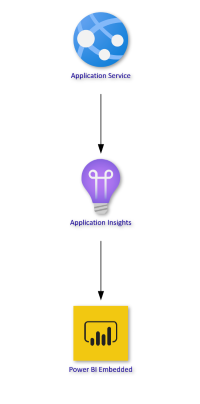
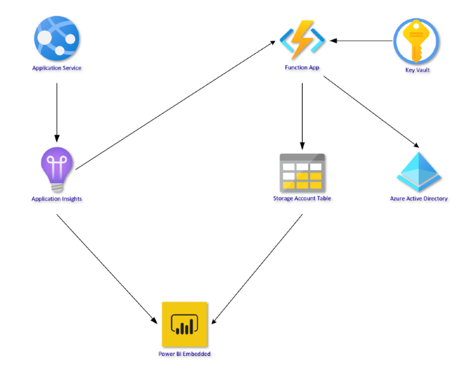

# How to set up the infrastructure

The core infrastructure consists of a web application whose content is deployed through Azure Pipelines and on top there is an App Insights that is responsible of monitoring all the activity that occurs (User spent time, URLs most consumed, etc).


## Requirements

The following Azure services are required:
- Application service
- Application Insights
- Function App (if we have AAD data)
- Storage Account Table (if we have AAD data)
- Key vault (if we have AAD data)
- Power BI Online
- Service Principal with reader permissions on Microsoft tenant to run the Function App (if we have AAD data)


## Solution Flow


Every time a user enters to the documentation page all the activity is monitored by App Insights and published into a Power BI Dashboard. We obtain the user names from each of the sessions with a little addon on the header of the pages (you can check how to configure the addon on the following section)

At this point we have two different approaches (and two different templates, one for each case): the first one with AAD data and the second one without this data.

### Without AAD Data

If we don't have the proper permissions to extract user data from the tenant the information/user activity is retrieved directly from Application insights workspace and embedded to the Power BI report.




### With AAD Data


There is some of the information like the user name, the job level, organization, manager name ... that needs to be extracted from the Microsoft AAD tenant because is not available in App Insights/Claims/Token. If we have AAD permissions the function app that retrieves this information using the user names as a key parameter and saves the results into a Storage account table.


> [!NOTE]
> This function must be run with a managed identity with **User.Read.All** permissions on the tenant



This storage account table is connected to the report using a connector and this allows us to enable auto refresh. The reason why we're doing this is because currently Power BI doesn't support dynamic data sources, and if we want to retrieve information from the graph API the URL is generated using the user name dynamically.


## Web App Configuration to extract the user names

App Insights does not store the name of the users accessing the web app, it stores the sessions. To relate these sessions with the user names and to be able to extract metrics, this piece of code needs to be added to the header.


> [!NOTE]
> It needs to be updated with the corresponding instrumentation key.

These are the instructions on how to configure the header in each page to retrieve the user information (as an example we're using the modern delivery):

- Go to the file file: ModernDeliveryInnerSource/head.tmpl.partial at main · microsoft-consulting-services/ModernDeliveryInnerSource (githubenterprise.com)
- Replace/add the following code under the <head> tag:


Code:
```diff
<script type="text/javascript">
!function(T,l,y){var S=T.location,u="script",k="instrumentationKey",D="ingestionendpoint",C="disableExceptionTracking",E="ai.device.",I="toLowerCase",b="crossOrigin",w="POST",e="appInsightsSDK",t=y.name||"appInsights";(y.name||T[e])&&(T[e]=t);var n=T[t]||function(d){var g=!1,f=!1,m={initialize:!0,queue:[],sv:"4",version:2,config:d};function v(e,t){var n={},a="Browser";return n[E+"id"]=a[I](),n[E+"type"]=a,n["ai.operation.name"]=S&&S.pathname||"_unknown_",n["ai.internal.sdkVersion"]="javascript:snippet_"+(m.sv||m.version),{time:function(){var e=new Date;function t(e){var t=""+e;return 1===t.length&&(t="0"+t),t}return e.getUTCFullYear()+"-"+t(1+e.getUTCMonth())+"-"+t(e.getUTCDate())+"T"+t(e.getUTCHours())+":"+t(e.getUTCMinutes())+":"+t(e.getUTCSeconds())+"."+((e.getUTCMilliseconds()/1e3).toFixed(3)+"").slice(2,5)+"Z"}(),iKey:e,name:"Microsoft.ApplicationInsights."+e.replace(/-/g,"")+"."+t,sampleRate:100,tags:n,data:{baseData:{ver:2}}}}var h=d.url||y.src;if(h){function a(e){var t,n,a,i,r,o,s,c,p,l,u;g=!0,m.queue=[],f||(f=!0,t=h,s=function(){var e={},t=d.connectionString;if(t)for(var n=t.split(";"),a=0;a<n.length;a++){var i=n[a].split("=");2===i.length&&(e[i[0][I]()]=i[1])}if(!e[D]){var r=e.endpointsuffix,o=r?e.location:null;e[D]=https://+(o?o+".":"")+"dc."+(r||"services.visualstudio.com")}return e}(),c=s[k]||d[k]||"",p=s[D],l=p?p+"/v2/track":config.endpointUrl,(u=[]).push((n="SDK LOAD Failure: Failed to load Application Insights SDK script (See stack for details)",a=t,i=l,(o=(r=v(c,"Exception")).data).baseType="ExceptionData",o.baseData.exceptions=[{typeName:"SDKLoadFailed",message:n.replace(/\./g,"-"),hasFullStack:!1,stack:n+"\nSnippet failed to load ["+a+"] -- Telemetry is disabled\nHelp Link: https://go.microsoft.com/fwlink/?linkid=2128109\nHost: "+(S&&S.pathname||"_unknown_")+"\nEndpoint: "+i,parsedStack:[]}],r)),u.push(function(e,t,n,a){var i=v(c,"Message"),r=i.data;r.baseType="MessageData";var o=r.baseData;return o.message='AI (Internal): 99 message:"'+("SDK LOAD Failure: Failed to load Application Insights SDK script (See stack for details) ("+n+")").replace(/\"/g,"")+'"',o.properties={endpoint:a},i}(0,0,t,l)),function(e,t){if(JSON){var n=T.fetch;if(n&&!y.useXhr)n(t,{method:w,body:JSON.stringify(e),mode:"cors"});else if(XMLHttpRequest){var a=new XMLHttpRequest;a.open(w,t),a.setRequestHeader("Content-type","application/json"),a.send(JSON.stringify(e))}}}(u,l))}function i(e,t){f||setTimeout(function(){!t&&m.core||a()},500)}var e=function(){var n=l.createElement(u);n.src=h;var e=y[b];return!e&&""!==e||"undefined"==n[b]||(n[b]=e),n.onload=i,n.onerror=a,n.onreadystatechange=function(e,t){"loaded"!==n.readyState&&"complete"!==n.readyState||i(0,t)},n}();y.ld<0?l.getElementsByTagName("head")[0].appendChild(e):setTimeout(function(){l.getElementsByTagName(u)[0].parentNode.appendChild(e)},y.ld||0)}try{m.cookie=l.cookie}catch(p){}function t(e){for(;e.length;)!function(t){m[t]=function(){var e=arguments;g||m.queue.push(function(){m[t].apply(m,e)})}}(e.pop())}var n="track",r="TrackPage",o="TrackEvent";t([n+"Event",n+"PageView",n+"Exception",n+"Trace",n+"DependencyData",n+"Metric",n+"PageViewPerformance","start"+r,"stop"+r,"start"+o,"stop"+o,"addTelemetryInitializer","setAuthenticatedUserContext","clearAuthenticatedUserContext","flush"]),m.SeverityLevel={Verbose:0,Information:1,Warning:2,Error:3,Critical:4};var s=(d.extensionConfig||{}).ApplicationInsightsAnalytics||{};if(!0!==d[C]&&!0!==s[C]){method="onerror",t(["_"+method]);var c=T[method];T[method]=function(e,t,n,a,i){var r=c&&c(e,t,n,a,i);return!0!==r&&m["_"+method]({message:e,url:t,lineNumber:n,columnNumber:a,error:i}),r},d.autoExceptionInstrumented=!0}return m}(y.cfg);(T[t]=n).queue&&0===n.queue.length&&n.trackPageView({})}(window,document,{
src: https://az416426.vo.msecnd.net/scripts/b/ai.2.min.js,

cfg: {
+    instrumentationKey: "XXXXXXXXXXXXXXXXXXXXXX"
}});
+ var telemetryInitializer = (envelope) => {
+ envelope.data.someField = 'This item passed through my telemetry initializer';
};
+ appInsights.addTelemetryInitializer(telemetryInitializer);
+ appInsights.trackTrace({message: 'This message will use a telemetry initializer'});
+ var id = null;
+ fetch('/.auth/me').then(function(response){
+ return response.json();
+ }).then(function(data){
+ id = data[0].user_id;
+ appInsights.setAuthenticatedUserContext(id);
});
</script>
```

## Function App

The function app runs Powershell code to extract the user information from the user activity on App Insights and store it into an Azure storage table. This function is triggered by time every 5 minutes and needs to be run by an identity with reader permissions on the Microsoft AD tenant.

> [!WARNING]
> Currently we're using a user account (instead a managed identity) with all the credentials stored in a Keyvault because the permissions were not granted yet (there's a support case ongoing to obtain the required permissions).

```powershell
# Input bindings are passed in via param block.
param($Timer)

################################################################################

Write-Host "Selecting subscription..."
Select-AzSubscription "77e5ad56-8b80-44a1-b5f0-f76d48aa44c9"

az account show

$appIdSecret = Get-AzKeyVaultSecret -VaultName "ccoe-kva" -Name "appId"
$appIdSS = [System.Runtime.InteropServices.Marshal]::SecureStringToBSTR($appIdSecret.SecretValue)
try {
    $appId = [System.Runtime.InteropServices.Marshal]::PtrToStringBSTR($appIdSS)
}
finally {
    [System.Runtime.InteropServices.Marshal]::ZeroFreeBSTR($appIdSS)
}

$appKeySecret = Get-AzKeyVaultSecret -VaultName "ccoe-kva" -Name "apiKey"
$appKeySS = [System.Runtime.InteropServices.Marshal]::SecureStringToBSTR($appKeySecret.SecretValue)
try {
    $apiKey = [System.Runtime.InteropServices.Marshal]::PtrToStringBSTR($appKeySS)
}
finally {
    [System.Runtime.InteropServices.Marshal]::ZeroFreeBSTR($appKeySS)
}

$Graphcred = Get-AzKeyVaultSecret -VaultName "ccoe-kva" -Name "mycred"
$CredKeySS = [System.Runtime.InteropServices.Marshal]::SecureStringToBSTR($Graphcred.SecretValue)
try {
    $CredKey = [System.Runtime.InteropServices.Marshal]::PtrToStringBSTR($CredKeySS)
}
finally {
    [System.Runtime.InteropServices.Marshal]::ZeroFreeBSTR($CredKeySS)
}

# EXAMPLE: "X-Api-Key" = "key1:GUID1,key2:GUID2"
$headers = @{"Content-Type" = "application/json" }
$headers.add("x-api-key", $apiKey)

$query = @{"query" = "pageViews | where timestamp >= ago(60d) | extend refUri_ = tostring(customDimensions.refUri) | where url contains('ccoe.azurewebsites.net') | distinct user_AuthenticatedId | where (user_AuthenticatedId contains 'microsoft.com' and user_AuthenticatedId !='')" }
$body = ConvertTo-Json $query | % { [regex]::Unescape($_) }

Write-Host "Retrieving information from Application Insights..."

$result = Invoke-RestMethod "https://api.applicationinsights.io/v1/apps/$appId/query" -Headers $headers -Body $body -Method POST
$userlist = $result.tables.rows

$UsersGraph = @()

################################################
Write-Host "Getting user data..."
az login -u XXXXXXXX@microsoft.com -p $CredKey --tenant "72f988bf-86f1-41af-91ab-2d7cd011db47"
az account get-access-token --resource "00000003-0000-0000-c000-000000000000"
$AuthResponse_access_token = ""


foreach ($user in $userlist) {
    $UsersGraph += Invoke-RestMethod -Uri "https://graph.microsoft.com/v1.0/users/$($user)" -Headers @{Authorization = "Bearer $($AuthResponse_access_token)" }
}

#storage account variables
Write-Host "Accessing the Storage Account..."

$resourceGroup = "ccoe-playbook"
$storageAccountName = "storageaccountccoepbc00"
$storageAccount = Get-AzStorageAccount -Name $storageAccountName -ResourceGroupName $resourceGroup
$ctx = $storageAccount.Context
$cloudTable = (Get-AzStorageTable -context $ctx -ErrorVariable ev -ErrorAction SilentlyContinue).CloudTable
$partitionKey = "Users"

Write-Host "Table name :" $cloudTable

foreach ($user in $UsersGraph) {
    Write-Host "Processing user: $($user.userPrincipalName)"
    if ($cloudTable) {
        try {
            Add-AzTableRow -table $cloudTable -partitionKey $partitionKey -rowKey $user.id -property @{"UserDisplayName" = $user.displayName; 'JobTitle' = $user.jobTitle; 'UserPrincipalName' = $user.userPrincipalName; } -UpdateExisting
        }
        catch{
            Write-Host "User $($user) Not Found"
        }
    }
    else {
        Write-host 'Table Storage Reference Not Found!'
    }
}
Write-Host "Table updated!"
################################################################################

# Get the current universal time in the default string format.
$currentUTCtime = (Get-Date).ToUniversalTime()

# The 'IsPastDue' property is 'true' when the current function invocation is later than scheduled.
if ($Timer.IsPastDue) {
    Write-Host "PowerShell timer is running late!"
}

# Write an information log with the current time.
Write-Host "PowerShell timer trigger function ran! TIME: $currentUTCtime"
```

## Infrastructure deployment

To deploy the infrastructure we use a yaml pipeline from which we deploy a **Key vault**, **Application insights** and a **Windows App service plan** and then for each of the stages (integration, staging and prod) it will deploy/update the app service with all the changes following a **runcOnce** strategy (Cannary and Rolling are also supported).

> [!NOTE]
> Cannary (reduce risk by slowly rolling out the change to a small subset of users. As you gain more confidence in the new version, you can begin to release it to more servers in your infrastructure and drive more users to it) and Rolling (replacing instances of the previous version of an application with instances of the new version of the application on a fixed set of machines (rolling set) in each iteration) are also supported.

### Common steps

```yaml
              steps:
                  - checkout: self
                  - task: AzureResourceManagerTemplateDeployment@3
                    displayName: 'key vault'
                    inputs:
                      deploymentScope: 'Resource Group'
                      azureResourceManagerConnection: $(azureRMServiceConnection)
                      subscriptionId: $(subscriptionId)
                      action: 'Create Or Update Resource Group'
                      resourceGroupName: $(resourceGroupName)
                      location: $(resourceGroupLocation)
                      templateLocation: 'Linked artifact'
                      csmFile: '$(keyVaultTemplateFilePath)'
                      csmParametersFile: '$(configFilePathKeyVault)'
                      deploymentMode: 'Incremental'
                      deploymentOutputs: 'OUTPUTS_KEYVAULT'
                      pwsh: true
                  - task: AzureResourceManagerTemplateDeployment@3
                    displayName: 'application insights'
                    inputs:
                      deploymentScope: 'Resource Group'
                      azureResourceManagerConnection: $(azureRMServiceConnection)
                      subscriptionId: $(subscriptionId)
                      action: 'Create Or Update Resource Group'
                      resourceGroupName: $(resourceGroupName)
                      location: $(resourceGroupLocation)
                      templateLocation: 'Linked artifact'
                      csmFile: '$(applicationInsightsTemplateFilePath)'
                      csmParametersFile: '$(configFilePathApplicationInsights)'
                      deploymentMode: 'Incremental'
                      deploymentOutputs: 'OUTPUTS_APPLICATIONINSIGHTS'
                      pwsh: true
                  - task: AzureResourceManagerTemplateDeployment@3
                    displayName: 'windows asp'
                    inputs:
                      deploymentScope: "Resource Group"
                      azureResourceManagerConnection: $(azureRMServiceConnection)
                      subscriptionId: $(subscriptionId)
                      action: "Create Or Update Resource Group"
                      resourceGroupName: "$(resourceGroupName)"
                      location: $(resourceGroupLocation)
                      templateLocation: "Linked artifact"
                      csmFile: "$(appServicePlanWindowsTemplateFilePath)"
                      csmParametersFile: "$(configFilePathAppServicePlanWindows)"
                      deploymentMode: "Incremental"
                      deploymentOutputs: "OUTPUTS_APPSERVICEPLANWINDOWS"
```

Stage/environment steps:
```yaml
      - deployment: int
        displayName: "deploy windows webapp"
        pool:
          vmImage: $(vmImageName)
        environment: $(intEnvironmentName)
        strategy:
          runOnce:
            deploy:
              steps:
                - checkout: self
                - task: AzureResourceManagerTemplateDeployment@3
                  displayName: 'app service'
                  inputs:
                    deploymentScope: 'Resource Group'
                    azureResourceManagerConnection: $(azureRMServiceConnection)
                    subscriptionId: $(subscriptionId)
                    action: 'Create Or Update Resource Group'
                    resourceGroupName: $(resourceGroupName)
                    location: $(resourceGroupLocation)
                    templateLocation: 'Linked artifact'
                    csmFile: '$(appServiceWindowsTemplateFilePath)'
                    csmParametersFile: '$(intConfigFilePathAppServiceWindows)'
                    deploymentMode: 'Incremental'
                    deploymentOutputs: 'OUTPUTS_WEBAPP_INT'
```

Once everything is deployed you can check the results on the different URLs:

- [Integration](https://evergreenip-int.azurewebsites.net)
- [Staging](https://evergreenip-staging.azurewebsites.net/)
- [Production](https://evergreenip.azurewebsites.net)

### Telemetry pipeline

For the telemetry infrastructure we're deploying a function app and a new service plan to host it (the function app was described previously). We have the **deploy.yml** and **variables.yml** files under the /pipelines/telemetry/ folder, the **application-insights.json** and **function-app.json** under pipelines/iacs/ folder  and the function parameters **egipfapp-telemetry.json** and **egipsp-telemetry.json** under /platform/telemetry/ folder.


#### Variables defined

```yaml
  ## Pipeline config
  # The ADO Service Connection to be used for the deployment
  azureRMServiceConnection: "Evergreen-Delivery-IP"
  #T he subscription ID where Infrastructure will be deployed
  subscriptionId: "4d186e10-e0a0-4555-a97f-7c8c2272d741"
  # Agent VM image name
  vmImageName: "ubuntu-latest"
  # View pipeline logs
  System.Debug: true
  # Path to platform IaC configuration files
  configFilesPath: "$(Build.SourcesDirectory)/platform"
  # Path to IaC modules path
  iacsTemplatesPath: "$(Build.SourcesDirectory)/pipelines/iacs"
  # Path to Windows App Service Plan module deployment template file
  appServicePlanWindowsTemplateFilePath: "$(iacsTemplatesPath)/app-service-plan-windows.json"
  # Path to Windows Function App module deployment template file
  functionAppTemplateFilePath: "$(iacsTemplatesPath)/function-app.json"

  ## Environment config
  # Name of the Resource Group where the infrastructure will be deployed
  resourceGroupName: "Evergreen-Delivery-IP"
  # Location of the Resource Group where the infrastructure will be deployed
  resourceGroupLocation: "West Europe"

  ## Common
  # Name given to the Azure pipelines deployment environment with deployment steps for the common hosting infrastructure elements, listed below
  telemetryEnvironmentName: "$(resourceGroupName)-telemetry"
  # Path to the Windows App Service Plan configuration file used to host the App Services for all environments
  configFilePathAppServicePlanWindows: "$(configFilesPath)/telemetry/egipsp-telemetry.json"
  # Path to the Windows App Service configuration file used to host the web app for the integration environment
  telemetryConfigFilePathFunctionApp: "$(configFilesPath)/telemetry/egipfapp-telemetry.json"
```

#### Deployment steps

```yaml
            deploy:
              steps:
                - checkout: self
                # deploy windows app service plan
                - task: AzureResourceManagerTemplateDeployment@3
                  displayName: "windows asp"
                  inputs:
                    deploymentScope: "Resource Group"
                    azureResourceManagerConnection: $(azureRMServiceConnection)
                    subscriptionId: $(subscriptionId)
                    action: "Create Or Update Resource Group"
                    resourceGroupName: "$(resourceGroupName)"
                    location: $(resourceGroupLocation)
                    templateLocation: "Linked artifact"
                    csmFile: "$(appServicePlanWindowsTemplateFilePath)"
                    csmParametersFile: "$(configFilePathAppServicePlanWindows)"
                    deploymentMode: "Incremental"
                    deploymentOutputs: "OUTPUTS_APPSERVICEPLANWINDOWS"

                - task: AzureResourceManagerTemplateDeployment@3
                  displayName: "function app"
                  inputs:
                    deploymentScope: "Resource Group"
                    azureResourceManagerConnection: $(azureRMServiceConnection)
                    subscriptionId: $(subscriptionId)
                    action: "Create Or Update Resource Group"
                    resourceGroupName: "$(resourceGroupName)"
                    location: $(resourceGroupLocation)
                    templateLocation: "Linked artifact"
                    csmFile: "$(functionAppTemplateFilePath)"
                    csmParametersFile: "$(telemetryConfigFilePathFunctionApp)"
                    deploymentMode: "Incremental"
                    deploymentOutputs: "OUTPUTS_APPSERVICEPLANWINDOWS"
```