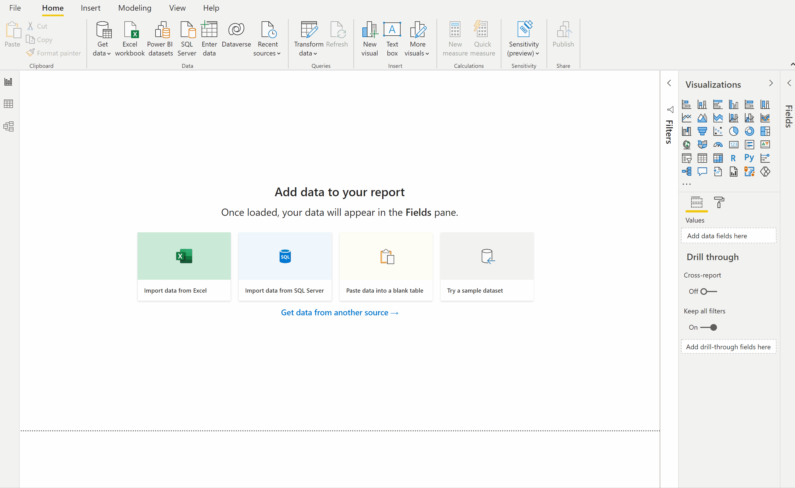
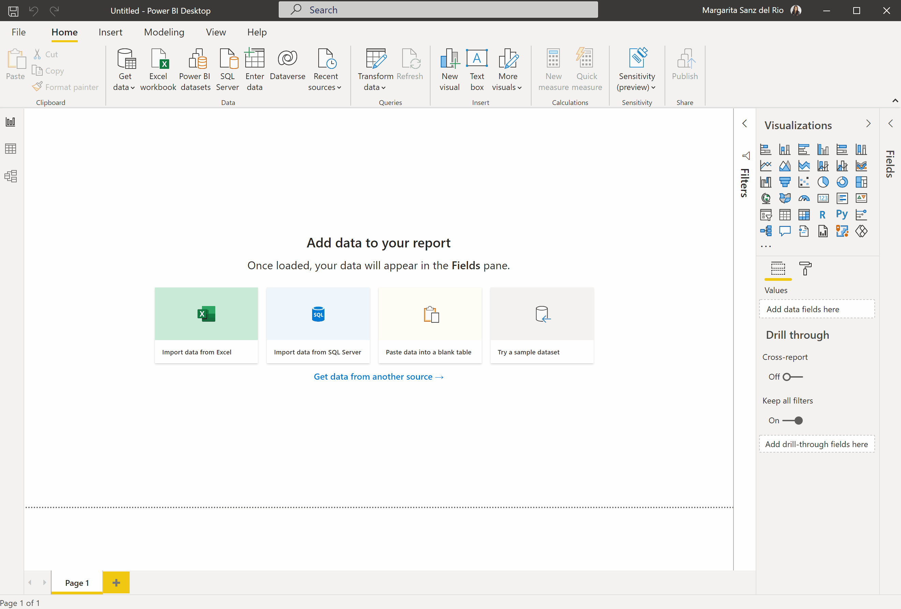
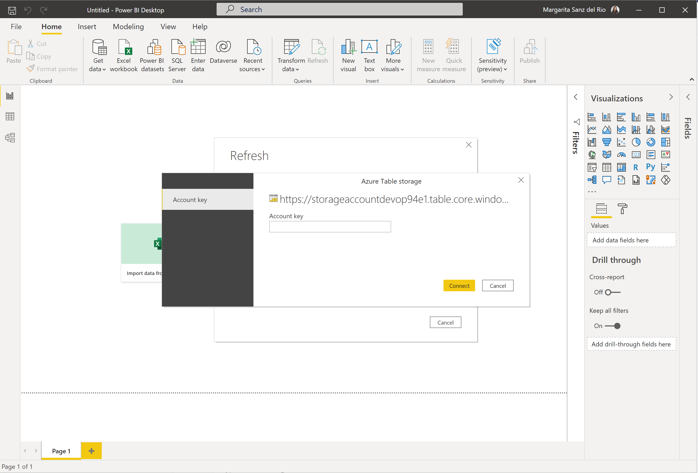
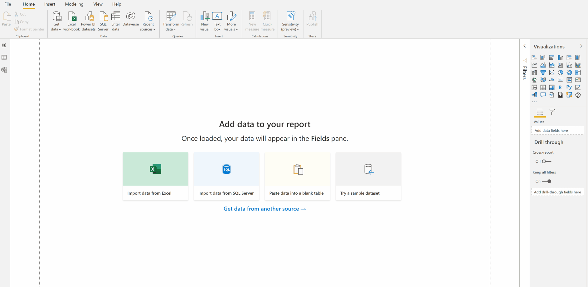
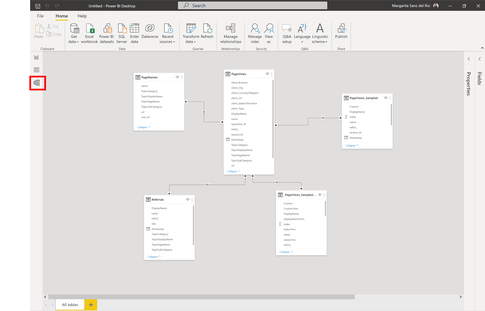
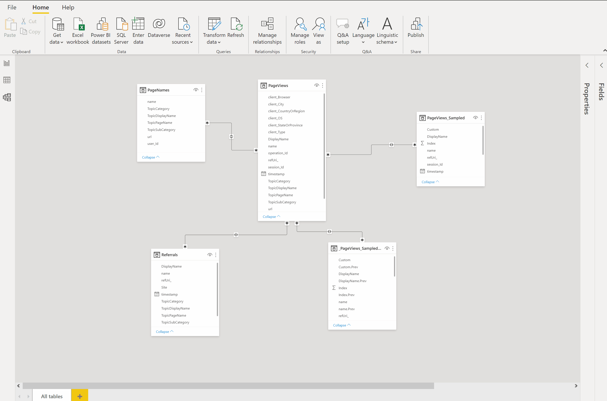

# Documentation lens consumption insights template

This template seeks to collect as much information as possible about the consumption of the documentation lens website. Understanding how users navigate through the pages, what content they consume most frequently or how the website grows in terms of consumption over time allows informed decisions to be made about the content and form with which the platform should evolve. As already introduced in other sections, this template is fed by the Application Insights against which the Web App is connected. This resource will be our source of the data model.

One of the most important data identified by the evergreen delivery IP team is **who** is accessing the content. Since the content to be pulished by innersource is internal, this guide shows how to set up authentication/authorization as part of the infrastructure. This configuration, together with other specifications defined in the [how to setup infrastructure](../how-to-setup-infrastructure.md#Web-App-Configuration-to-extract-the-user-names) section, allows retrieving the UPN (User Principal Name) of the user accessing the content. Through the UPN and by making REST calls to the AzureAD API, we can know data such as the user's role, location and manager. Depending on the content that is being innersourced, this can be fundamental data when determining the impact and potential opportunities with customers that can be generated.

However, there are certain limitations in the Power BI service when it comes to making dynamic calls against any URL. The content that is published in the Power BI SaaS service cannot be dynamic content. This means that there can be no data sources that depend on other sources. For example, if we make a call to App Insights to retrieve the user's username and then use this data to gather more information from the Azure Active Directory, the Power BI web publishing service will detect a dependency between data sources and will not allow to auto-refresh the dashboard. Therefore, two different templates are available:

- **AAD integrated template**: this template implements calls against the Graph API and includes information such as how many different roles consume the content, where the user is based or to which organization the user belongs. This is the most information-rich option but cannot be published in the Power BI SaaS service.

<iframe width="100%" height="541.25" src="https://msit.powerbi.com/reportEmbed?reportId=f55af337-ad2e-42e1-974e-d317d6bf1cb9&autoAuth=true&ctid=72f988bf-86f1-41af-91ab-2d7cd011db47&config=eyJjbHVzdGVyVXJsIjoiaHR0cHM6Ly9kZi1tc2l0LXNjdXMtcmVkaXJlY3QuYW5hbHlzaXMud2luZG93cy5uZXQvIn0%3D" frameborder="0" allowFullScreen="true"></iframe>

- **No AAD integrated template**: for those scenarios where having the dashboard published and accessible through the internet is a requirement, this template allows you to do so although, as a counterpoint, it does not provide user information beyond the UPN.

<iframe width="100%" height="541.25" src="https://msit.powerbi.com/reportEmbed?reportId=8cabba6c-8e76-470a-a893-d027eb0ed1a6&autoAuth=true&ctid=72f988bf-86f1-41af-91ab-2d7cd011db47&config=eyJjbHVzdGVyVXJsIjoiaHR0cHM6Ly9kZi1tc2l0LXNjdXMtcmVkaXJlY3QuYW5hbHlzaXMud2luZG93cy5uZXQvIn0%3D" frameborder="0" allowFullScreen="true"></iframe>

## How to configure the AAD integrated template

This template relies on the infrastructure explained in the [With AAD Data section](../how-to-setup-infrastructure.md#With-AAD-Data). To setup your dashboard by leveraging the AAD integrated template, please follow these steps:

1. If you don't have it already download and intall Power BI Desktop application from the [Microsoft Store](https://www.microsoft.com/en-us/p/power-bi-desktop/9ntxr16hnw1t?activetab=pivot:overviewtab)
2. Find the [AAD integrated template here](https://microsofteur.sharepoint.com/:u:/t/EvergreenDeliveryIP/EchZhVUS2V5Hh1-okHmspgsBBbVTsIIpQD0hkDG47jBFUA?e=GSKNw5) and download it.
3. Before opening the template, we first need to clear the credentials. Open Power BI Desktop application. Go to `File > Options and settings > Data source settings`. From the Global permission tab, select all sources showing and click on `Clear Permissions`. After that close the window.

    

> [!NOTE]
> If you don't have any permissions pre-configured in your Power BI Desktop, then you are good to go.

4. Open the template by going to `File > Open report > Browse report`. While loading, it will ask you for some data. Please follow the instructions given in the description boxes and fill in the Application insights workspace ID and the storage account table URL.

    

    As shown in the video, for the Application Insights connection, you will be asked to connect with your credentials. Please, when promped for your credentials, select `Organization Account` and enter your Microsoft account. Once signed in, click `connect`.

    For the storage account connection, you will also be prompted for the Account key of such Storage. Please, go `Azure portal > Storage Account > Select your Storage Account > Access Keys > key 1`. Copy this value and paste it in the box. Then click `connect`.

    

Now you are ready to start monitoring the consumption of your innersource application!

## How to configure and publish the No AAD integrated template

This template relies on the infrastructure explained in the [Without AAD Data section](../how-to-setup-infrastructure.md#Without-AAD-Data). Please, use this template if you want it to be published in the Power BI SaaS service. To setup your dashboard please follow these steps:

1. If you don't have it already download and intall Power BI Desktop application from the [Microsoft Store](https://www.microsoft.com/en-us/p/power-bi-desktop/9ntxr16hnw1t?activetab=pivot:overviewtab)
2. Find the [No AAD integrated template here](https://microsofteur.sharepoint.com/:u:/t/EvergreenDeliveryIP/Efv-pDX2L9BHtKoiV1Lb98wBpSDsY5kgu39hysbKUC4FSg?e=GyNT9R) and download it.
3. Before opening the template, we first need to clear the credentials. Open Power BI Desktop application. Go to `File > Options and settings > Data source settings`. From the Global permission tab, select all sources showing and click on `Clear Permissions`. After that close the window.

    

> [!NOTE]
> If you don't have any permissions pre-configured in your Power BI Desktop, then you are good to go.

4. Open the template by going to `File > Open report > Browse report`. While loading, it will ask you for some data. Please follow the instructions given in the description boxes and fill in the Application insights workspace ID.

    

    As shown in the video, for the Application Insights connection, you will be asked to connect with your credentials. Please, when promped for your credentials, select `Organization Account` and enter your Microsoft account. Once signed in, click `connect`.

Now you are ready to start monitoring the consumption of your innersource application!

## Behind the scenes: the data model

In this section we will explain what the data model is and how to work with it. This is important since there may be a scenario in which the template does not sufficiently fit the level of detail your team is looking for/needs.

In order to see which tables are being used, what fields each table has and how they relate to each other, click on the `Model` button in Power BI Desktop. This view gives you, at a glance, all the relevant information from which the various charts are then fed. Use it to find out if the new fields you need are already available, or if you should alter the model itself to fit your scenario.

If the format of the data that appears is not the right one, or you need other data, then you will have to modify the queries that are made to the different data sources. To do this, click on `Transform data`. A new window will open where, by clicking on `Advanced editor`, you will be able to see the original call together with all the transformations made to the data. In addition, from here you can also edit the template input parameters. Once you have the data to your liking, click on `Close & Apply` to close this window and load the new tables in your model.

