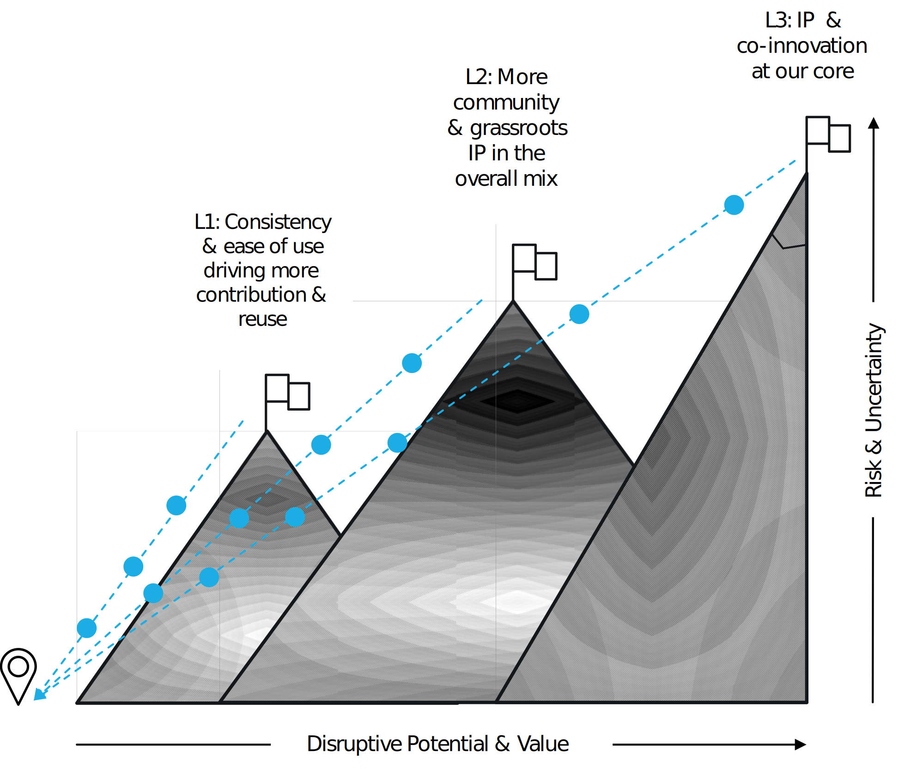

# Horizons

Overall vision that the evergreen delivery IP is contributing towards is to have IP and co-innovation (inside Services, with PG, with customers and partners) at the core of our approach.

Figure below shows the three horizons plan with first level 1 goal being consistency in capturing and discovering IP, second being more grassroots and community involvement and third one being transformation to more IP and co-innovation based approach.

- **The Vision:** co-innovating with partners and customers, leveraging all learnings out of our engagements in a consistent way, enabling grassroots IP contribution and growth

- **Horizon 3:** significant cultural change to enable inner source based internal and external (partners/customers) co-innovation of Services IP, most projects either leverage existing IP or create new one or both, dedicated resource pods working in top investment areas to sustain IP and improve it over time

- **Horizon 2:** processes and tools, investment model created to enable pockets of excellence in field creating IP together with customers and partners, sustaining it over time and driving project reuse through metrics and customer feedback

- **Horizon 1:** enabling uniform approach for managing various types of delivery IP across domain to drive ease of use in finding, reusing and contributing back; metrics-based assessment, SAO teams example of adoption
