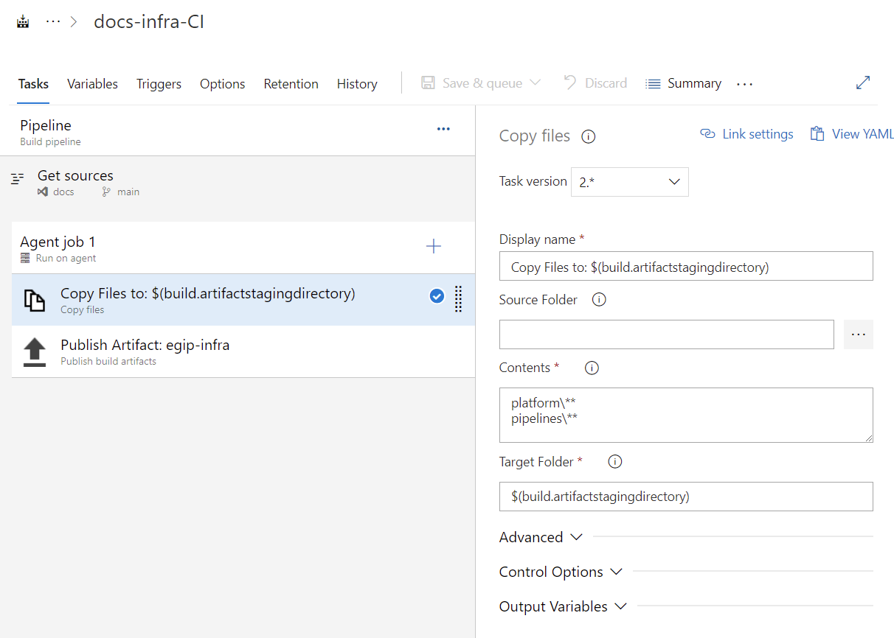
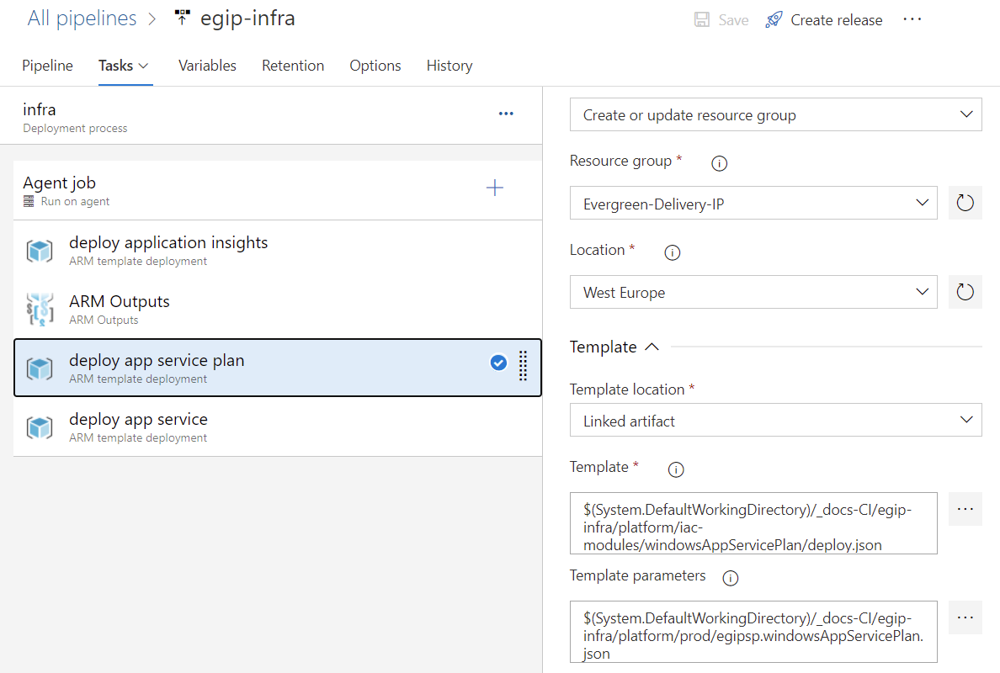
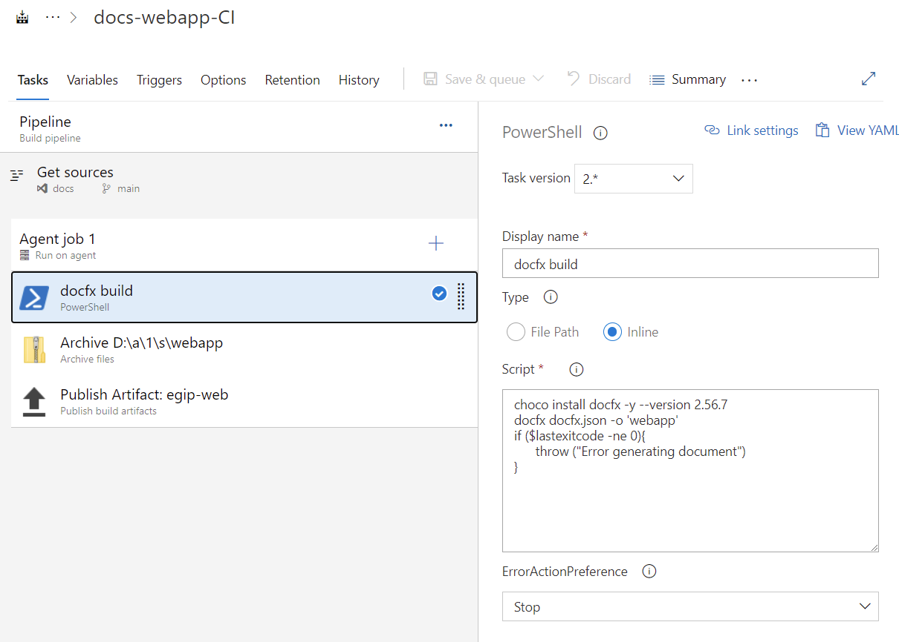
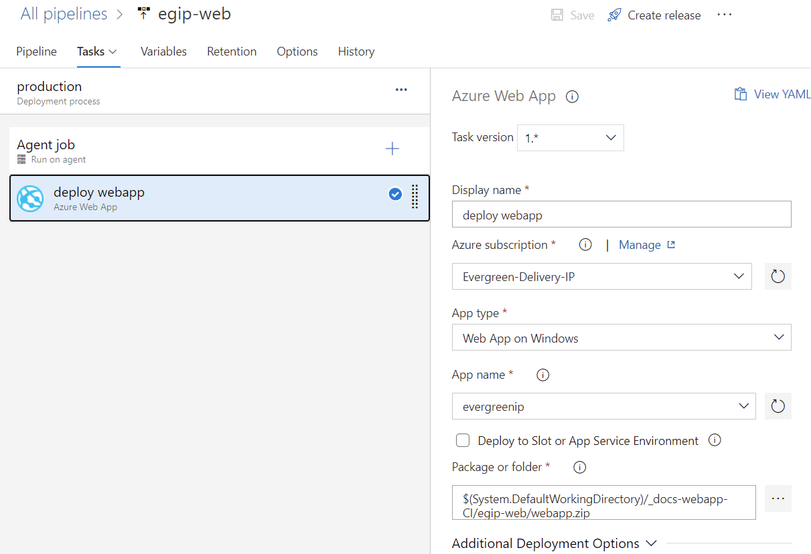

# Overview

This section provides guidance to set-up [Azure DevOps Graphical User Interface Pipelines](https://docs.microsoft.com/en-us/azure/devops/pipelines/release/?view=azure-devops) to configure:

- Continuous Integration and Continouos Delivery of your site [hosting infrastructure](#infrastructure-cicd).
- Continuous Integration and Continouos Delivery of your site [web application](#web-site-cicd).

# Infrastructure CI/CD

## Approach

The infrastructure required for self-hosting the documentation web site and also having app insights based insights into the usage of the site contains:

- [Azure App Service Plan](https://azure.microsoft.com/en-us/services/app-service/) used to provision environment for hosting web site
- [Azure Web App](https://azure.microsoft.com/en-us/services/app-service/web/) to host the web site itself
- [Azure Monitor AppInsights](https://azure.microsoft.com/en-us/services/monitor/) to track the usage of the site
- 2 app registrations:
  - one to get access to Azure to be able to deploy the solution into resource group (need contributor permissions assigned), configured Service Connections settings of the ADO
  - another one to host the web site (and register it with Azure AD of MSIT for single sign-on)

The approach for self-service site hosting provides configuration modules from the [infrastructure as code work](https://dev.azure.com/servicescode/infra-as-code-source) and therefore relies on build and release pipelines dependant on these base modules and configuration files.

> [!NOTE]
> The file examples used for the deployment of this documentation site are available as a starter kit in [Evergreen Repo => `/platform/iac-modules` and `/platform/prod`](https://dev.azure.com/evergreen-delivery-ip/_git/docs?path=%2Fplatform&version=GBmain).

To see the entire infrastructure configured including provisioning application registrations, please watch the [video below](#example-of-configuration).

## Infrastructure Build Pipeline

Using the configuration modules and the configuration files build and release pipelines can be configured for the deployment of initial version of the web app and later for deployment of changes. The build pipeline's main task it to get those module files and configuration scripts and publish them as artifact for release pipeline to be able to use.

## Infrastructure Release Pipeline

Release pipeline is more complex as it contains multiple deployment steps:

1. Deploy app insights
2. Extract app insights ID (leveraging third party build pipeline task ARM outputs that needs to be installed in organization hosting the pipelines/repo)
3. Deploy app service plan to host the web site
4. Deploy the app itself

> [!NOTE]
> Suggested release name format for detailed tracking: `$(Release.DefinitionName)-$(Date:yyyyMMdd)$(Rev:.rr)`

> [!WARNING]
> Note also that because MSIT AD is locked down in a specific way and does not allow service account provisioning and linking from web apps automatically, there need to be two steps performed as part of initial deployment: (1) deployment of the web site without the WindowsAppServiceAuthenticationADApplicationId parameter being specified (this will mean the site is anonymous initially) and (2) after getting the application ID once more with this parameter containing the value provided by ID for the application.

# Web Site CI/CD

## Web Site Approach

Build and deployment of the documentation web site leverages previously provisioned [infrastructure](#infrastructure-cicd).

## Web Site Build Pipeline

The build process consists of these steps:

1. Building the DOCFX web site
2. Packaging the web site built
3. Publishing the artifact to that release pipelines can pick it up and deploy

> [!WARNING]
> When packaging the documentation site, remove the prepend root folder name to achieve paths to ensure that your web site's root will be root of the application. We had first missed this in the [video below](#example-of-configuration).

## Web Site Release Pipeline

Web site release pipeline is simpler because the only thing that it does is it uses standard web app deploy task to push the ZIP file created to the web site.

# Example of Configuration

For a walk-through of these changes being made to existing repository and introducing both initial DOCFX configuration as well as setting up the infrastructure configuration and CI/CD for deploying the documentation site see the video below.

The video shows also some "troubleshooting" of AD integration configuration and one build pipeline setting as we uncover and remove some blockers (aka ['evergivens'](https://en.wikipedia.org/wiki/Ever_Given#/media/File:Container_Ship_'Ever_Given'_stuck_in_the_Suez_Canal,_Egypt_-_March_24th,_2021_cropped.jpg)).

<iframe width="853" height="480" src="https://msit.microsoftstream.com/embed/video/2cba0840-98dc-94b1-a286-f1eb9e919991?autoplay=false&amp;showinfo=true" allowfullscreen style="border:none; position: absolute; top: 0; left: 0; right: 0; bottom: 0; height: 100%; max-width: 100%;"></iframe>

The example files for pipelines, TOC, DOCFX JSON used in the video as starters that you can modify for your pipelines you can find part of the [evergreen delivery ip docs repository](http://aka.ms/evergreeniprepo).
