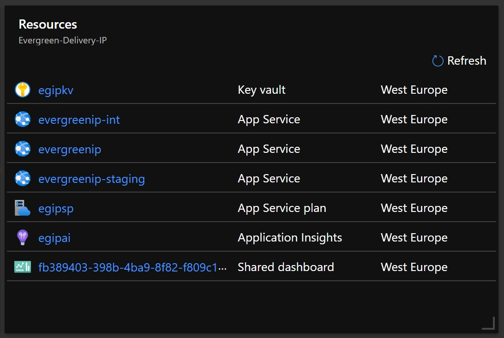
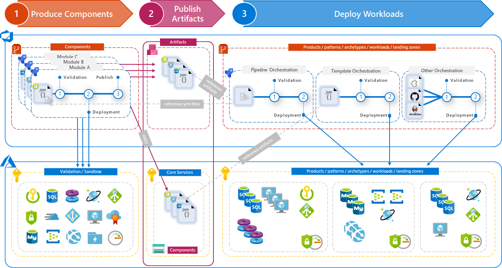

# Infrastructure as Code

We implement Infrastructure as Code to speed up configuration, deployment, maintenance and evolution of the hosting infrastructure, avoid environment configuration drift, and achieve the full discipline of Continuos Delivery for Azure hosting infrastructure.



We leverage ARM Template and MCS [infra-as-code-source](https://aka.ms/iacs) assets, principles and practices to implement Infrastructure as Code consistently.


## Strategy

### Modular strategy

> [!NOTE]
> Learn more at [MCS Infrastructure as Code Source (IaCS)](https://dev.azure.com/servicescode/infra-as-code-source/_wiki/wikis/Wiki/3731/Home)

How you design infrastructure as code templates is entirely up to you and how you want to manage your solution. You can deploy your complex infrastructure through a single template to a single resource group; but development of infrastructure as code and configuration as code can easily become complex and unmaintainable, then it makes sense to divide your deployment requirements into a set of **targeted, purpose-specific templates**.

For infrastructure as code, same principles as in software development can be adapted and followed to help developers produce flexible and maintainable code (SOLID, 12 factor app, etc.).

> Following the [SOLID](https://medium.com/backticks-tildes/the-s-o-l-i-d-principles-in-pictures-b34ce2f1e898) principle of single responsibility we develop each module within its’ own lifecycle and all the [DevOps practices](https://devopsdojodocs.azurewebsites.net/about/devops-dojo.html#3-a-standard-software-delivery-method) apply. Each IaC module should be reusable and have a single responsibility and thus only a single reason to change

A module is a **reusable combination of infrastructure and configuration as code templates and scripts that will let you manage your infrastructure in Azure through one or more idempotent operations (create, remove, etc.)**. Each module will target a single Azure Resource Provider.


Modules are written in an quite flexible way, therefore you don’t need to modify them from project to project, as the aim is to cover most of the functionality that a given resource type can provide, in a way that you can interact with any module just by sending the required parameters to it – i.e. you don’t have to know how the template of the particular module works inside, just take a look at the readme.md file of the given module to consume it.

The [modules](https://dev.azure.com/servicescode/infra-as-code-source/_wiki/wikis/Wiki/3761/Modules) are multi-purpose, therefore contain a lot of dynamic expressions (functions, variables, etc.), so there’s no need to maintain multiple instances for different use cases. E.g. there’s only one VM template that covers all scenarios.

### Pipeline orchestrated deployments

> [!NOTE]
> Learn more at [MCS Infrastructure as Code Source (IaCS) Deployment options](https://dev.azure.com/servicescode/infra-as-code-source/_wiki/wikis/Wiki/3765/Deployment-options)

With pipeline orchestrated deployments, we use Azure DevOps pipelines as glue or orchestration for deploying Modules in an Azure environment.

Pipeline orchestration has two possible strategies:

- **Service-chains** (directly references the source code of Modules) - quicker and simpler to set up and use.
- **Uses Azure DevOps Artifacts** (Universal packages) - this is safer, as the solutions deployed in Azure are not directly associated with the source code of Modules

For simplicity, we use the Service-chains approach.



See Deployment guidance in sections:

- [Azure DevOps GUI pipelines](azure-devops-gui-pipelines.md) for graphical interface pipelines
- [Azure DevOps YAML pipelines](azure-devops-yaml-pipelines.md) for YAML pipelines

## Repository Structure

To enable the strategies mentioned in the sections above, we organize the repository in the following way:

```Tree
|-- / (root)
    |-- pipelines/
    |     |-- iacs/
    |     |   |-- app-service-plan-windows.json
    |     |   |-- app-service-windows.json
    |     |   |-- application-insights.json
    |     |   |-- key-vault.json
    |     |-- infra/
    |     |   |-- deploy.yml
    |     |   |-- variables.yml
    |-- platform/
          |-- common/
          |   |-- egipai.json
          |   |-- egipkv.json
          |   |-- egipsp.json
          |-- int/
          |   |-- evergreenip-int.json
          |-- prod/
          |   |-- evergreenip.json
          |-- staging/
              |-- evergreenip-staging.json
```

Where:

- `pipelines/iacs/` directory contains all Infrastructure as Code modules that we will use to deploy our infrastructure.
- `pipelines/infra/` directory contains the YAML pipeline and YAML variables file to implement continuous integration and continuous delivery of the infrastructure. See [Infrastructure Pipeline](azure-devops-yaml-pipelines.md)
- `platform/commons/` directory contains the configuration of the modules that are part of the common environment
- `platform/int/` directory contains the configuration files of the modules that are part of the integration environment
- `platform/prod/` directory contains the configuration files of the modules that are part of the production environment
- `platform/staging/` directory contains the configuration files of the modules that are part of the staging environment

## IaC Modules

### Key Vault

> [!NOTE]
> See [Key Vault module](https://dev.azure.com/servicescode/infra-as-code-source/_git/Components?path=%2FModules%2FARM%2FKeyVault) in IaCs library

[Azure Key Vault](https://docs.microsoft.com/en-us/azure/key-vault/general/basic-concepts) is a cloud service for securely storing and accessing secrets. A secret is anything that you want to tightly control access to, such as API keys, passwords, certificates, or cryptographic keys. Key Vault service supports two types of containers: vaults and managed hardware security module(HSM) pools. Vaults support storing software and HSM-backed keys, secrets, and certificates. Managed HSM pools only support HSM-backed keys


We use Key Vault to re-use unpredictable configurations such as Application Insights Instrumentation key required during module deployment.

> [!NOTE]
> See the [Application Insights module](https://dev.azure.com/evergreen-delivery-ip/_git/docs?path=%2Fpipelines%2Fiacs%2Fapplication-insights.json) that we use in our Evergreen Repository

```json
{
  "$schema": "https://schema.management.azure.com/schemas/2019-04-01/deploymentTemplate.json#",
  "contentVersion": "1.0.0.0",
  "parameters": {
    "KeyVaultName": {
      "type": "string",
      "metadata": {
        "description": "Name of the Key Vault resource. Unique Public DNS Name, so no duplicated names can exist"
      }
    },
    "KeyVaultLocation": {
      "type": "string",
      "defaultValue": "[resourceGroup().location]",
      "metadata": {
        "description": "The supported Azure Region where the key vault should be created"
      }
    },
    "KeyVaultSKUName": {
      "type": "string",
      "allowedValues": [
        "standard",
        "premium"
      ],
      "metadata": {
        "description": "Azure Key Vault is offered in two service tiers, standard or premium"
      }
    },
    "KeyVaultEnabledForDeployment": {
      "type": "bool",
      "defaultValue": true,
      "metadata": {
        "description": "In order for Key Vault to be used with Azure Resource Manager virtual machines, the EnabledForDeployment property on Key Vault must be set to true"
      }
    },
    "KeyVaultEnabledForDiskEncryption": {
      "type": "bool",
      "defaultValue": true,
      "metadata": {
        "description": "For enhanced virtual machine (VM) security and compliance, virtual disks in Azure can be encrypted"
      }
    },
    "KeyVaultEnabledForTemplateDeployment": {
      "defaultValue": true,
      "type": "bool",
      "metadata": {
        "description": "When you need to pass a secure value (like a password) as a parameter during deployment. The value is never exposed because you only reference its key vault ID"
      }
    },
    "KeyVaultEnableSoftDelete": {
      "type": "bool",
      "defaultValue": true,
      "metadata": {
        "description": "To be able to recover deleted objects"
      }
    },
    "KeyVaultCreateMode": {
      "type": "string",
      "allowedValues": [
        "default",
        "recover"
      ],
      "defaultValue": "default",
      "metadata": {
        "description": "To indicate whether the vault need to be recovered or not"
      }
    },
    "KeyVaultAccessPolicies": {
      "type": "array",
      "metadata": {
        "description": "Access Policy List"
      },
      "defaultValue": []
    },
    "KeyVaultEnableFirewall": {
      "type": "bool",
      "defaultValue": false,
      "metadata": {
        "description": "Indicates if the Firewall must be enabled for the Key Vault"
      }
    },
    "KeyVaultMicrosoftServicesBypassFirewall": {
      "type": "bool",
      "defaultValue": false,
      "metadata": {
        "description": "Indicates if must allow trusted Microsoft services to bypass the firewall"
      }
    },
    "KeyVaultFirewallAllowedSubnets": {
      "type": "array",
      "defaultValue": [],
      "metadata": {
        "description": "Information of existing virtual networks and subnets allowed to access the KeyVault"
      }
    },
    "KeyVaultFirewallAllowedPublicIPs": {
      "type": "array",
      "defaultValue": [],
      "metadata": {
        "description": "List of IPv4 IPs or ranges to allow access from the internet to the KeyVault"
      }
    },
    "KeyVaultFirewallAllowedFirewallIps": {
      "type": "string",
      "defaultValue": "",
      "metadata": {
        "description": "Allowed firewall IPs",
        "AllEnvironmentsAutoAssignValueFromVariablesKeyVaultSecretName": "allowedFirewallIPs"
      }
    }
  },
  "variables": {
    "KeyVaultTenantId": "[subscription().tenantId]",
    "KeyVaultByPassFirewallTrue": "AzureServices",
    "KeyVaultByPassFirewallFalse": "None",
    "KeyVaultFirewallAllowedFirewallIpsArray": "[if(empty(parameters('KeyVaultFirewallAllowedFirewallIps')),variables('EmptyArray'),if(contains(parameters('KeyVaultFirewallAllowedFirewallIps'),','),split(parameters('KeyVaultFirewallAllowedFirewallIps'),','),array(parameters('KeyVaultFirewallAllowedFirewallIps'))))]",
    "KeyVaultFirewallAllIP": "[concat(if(empty(parameters('KeyVaultFirewallAllowedPublicIPs')),variables('EmptyArray'),parameters('KeyVaultFirewallAllowedPublicIPs')), variables('KeyVaultFirewallAllowedFirewallIpsArray'))]",
    "KeyVaultFirewallBypassAzureServices": "[if(parameters('KeyVaultMicrosoftServicesBypassFirewall'),variables('KeyVaultByPassFirewallTrue'),variables('KeyVaultByPassFirewallFalse'))]",
    "KeyVaultFirewallAllowedSubnetsArrayCount": "[length(parameters('KeyVaultFirewallAllowedSubnets'))]",
    "KeyVaultFirewallAllowedSubnetsArrayEmpty": "[equals(variables('KeyVaultFirewallAllowedSubnetsArrayCount'),0)]",
    "KeyVaultFirewallAllowedIPsArrayCount": "[length(variables('KeyVaultFirewallAllIP'))]",
    "KeyVaultFirewallAllowedIPsArrayEmpty": "[equals(variables('KeyVaultFirewallAllowedIPsArrayCount'),0)]",
    "copy": [
      {
        "name": "KeyVaultFirewallAllowedSubnets",
        "count": "[if(variables('KeyVaultFirewallAllowedSubnetsArrayEmpty'),1,variables('KeyVaultFirewallAllowedSubnetsArrayCount'))]",
        "input": {
          "id": "[if(variables('KeyVaultFirewallAllowedSubnetsArrayEmpty'),' ',concat('/subscriptions/',parameters('KeyVaultFirewallAllowedSubnets')[copyIndex('KeyVaultFirewallAllowedSubnets')].VNetSubscriptionId,'/resourceGroups/',parameters('KeyVaultFirewallAllowedSubnets')[copyIndex('KeyVaultFirewallAllowedSubnets')].VNetResourceGroupName,'/providers/Microsoft.Network/virtualnetworks/',parameters('KeyVaultFirewallAllowedSubnets')[copyIndex('KeyVaultFirewallAllowedSubnets')].VNetName,'/subnets/',parameters('KeyVaultFirewallAllowedSubnets')[copyIndex('KeyVaultFirewallAllowedSubnets')].VNetSubnetName))]",
          "action": "Allow"
        }
      },
      {
        "name": "KeyVaultFirewallAllowedIpAddresses",
        "count": "[if(variables('KeyVaultFirewallAllowedIPsArrayEmpty'),1,variables('KeyVaultFirewallAllowedIPsArrayCount'))]",
        "input": {
          "value": "[if(variables('KeyVaultFirewallAllowedIPsArrayEmpty'),' ',variables('KeyVaultFirewallAllIP')[copyIndex('KeyVaultFirewallAllowedIpAddresses')])]",
          "action": "Allow"
        }
      }
    ],
    "EmptyArray": [],
    "firewallEnabled": {
      "bypass": "[variables('KeyVaultFirewallBypassAzureServices')]",
      "virtualNetworkRules": "[if(variables('KeyVaultFirewallAllowedSubnetsArrayEmpty'),variables('EmptyArray'),variables('KeyVaultFirewallAllowedSubnets'))]",
      "ipRules": "[if(variables('KeyVaultFirewallAllowedIPsArrayEmpty'),variables('EmptyArray'),variables('KeyVaultFirewallAllowedIpAddresses'))]",
      "defaultAction": "Deny"
    },
    "firewallDisabled": {
      "defaultAction": "Allow"
    }
  },
  "resources": [
    {
      "type": "Microsoft.KeyVault/vaults",
      "name": "[parameters('KeyVaultName')]",
      "apiVersion": "2016-10-01",
      "location": "[parameters('KeyVaultLocation')]",
      "properties": {
        "tenantId": "[variables('KeyVaultTenantId')]",
        "sku": {
          "family": "A",
          "name": "[parameters('KeyVaultSKUName')]"
        },
        "accessPolicies": "[parameters('KeyVaultAccessPolicies')]",
        "enabledForDeployment": "[parameters('KeyVaultEnabledForDeployment')]",
        "enabledForDiskEncryption": "[parameters('KeyVaultEnabledForDiskEncryption')]",
        "enabledForTemplateDeployment": "[parameters('KeyVaultEnabledForTemplateDeployment')]",
        "enableSoftDelete": "[if(parameters('KeyVaultEnableSoftDelete'), json('true'), json('null'))]",
        "createmode": "[parameters('KeyVaultCreatemode')]",
        "networkAcls": "[if(parameters('KeyVaultEnableFirewall'),variables('firewallEnabled'),variables('firewallDisabled'))]"
      }
    }
  ],
  "outputs": {}
}
```

### Application Insights

> [!NOTE]
> See [Application Insights module](https://dev.azure.com/servicescode/infra-as-code-source/_git/Components?path=%2FModules%2FARM%2FApplicationInsights) in IaCs library

[Application Insights](https://docs.microsoft.com/en-us/azure/azure-monitor/app/app-insights-overview), is an extensible Application Performance Management (APM) service for developers and DevOps professionals. Use it to monitor your live applications. It will automatically detect performance anomalies, and includes powerful analytics tools to help you diagnose issues and to understand what users actually do with your app. It's designed to help you continuously improve performance and usability. It works for apps on a wide variety of platforms including .NET, Node.js, Java, and Python hosted on-premises, hybrid, or any public cloud. It integrates with your DevOps process, and has connection points to a variety of development tools. It can monitor and analyze telemetry from mobile apps by integrating with Visual Studio App Center.


We use Application Insights to monitor the usage of our published documentation.

The ARM Template that we use for Application Insights deployment can be seen below. Notice that we output the value of the Application Insights, which is generated by Azure during the service deployment and cannot be anticipated, in two ways:

- As secret of the Key Vault passed as parameter
- As output of the ARM Template

This approach allows to reuse this value for configuration in future module deployments.

> [!NOTE]
> See the [Application Insights module](https://dev.azure.com/evergreen-delivery-ip/_git/docs?path=%2Fpipelines%2Fiacs%2Fapplication-insights.json) that we use in our Evergreen Repository

```json
{
  "$schema": "https://schema.management.azure.com/schemas/2019-04-01/deploymentTemplate.json#",
  "contentVersion": "1.0.0.0",
  "parameters": {
    "AppInsightsName": {
      "metadata": {
        "description": "The name of the Application Insights"
      },
      "type": "string"
    },
    "AppInsightsLocation": {
      "type": "string",
      "metadata": {
        "description": "The location for the Application Insights."
      }
    },
    "AppInsightsApplicationType": {
      "metadata": {
        "description": "The type of Application Insights"
      },
      "type": "string",
      "defaultValue": "web",
      "allowedValues": [
        "MobileCenter",
        "web",
        "other",
        "java",
        "Node.JS"
      ]
    },
    "AppInsightsKeyVaultName": {
      "type": "string",
      "metadata": {
        "description": "Name of the Key Vault where the Account's Connection Strings and Keys will be saved"
      },
      "defaultValue": ""
    },
    "AppInsightsSecretNameInstrumentationKey": {
      "type": "string",
      "defaultValue": "",
      "metadata": {
        "description": "Output secret name for primary master key"
      }
    }
  },
  "variables": {
    "AppInsightsSecretNameSecondaryMasterKey": "[if(not(empty(parameters('AppInsightsSecretNameInstrumentationKey'))), parameters('AppInsightsSecretNameInstrumentationKey'), concat(parameters('AppInsightsName'),'-instrumentation-key'))]"
  },
  "resources": [
    {
      "type": "Microsoft.Insights/components",
      "apiVersion": "2015-05-01",
      "name": "[parameters('AppInsightsName')]",
      "location": "[parameters('AppInsightsLocation')]",
      "kind": "[parameters('AppInsightsApplicationType')]",
      "properties": {
        "Application_Type": "[parameters('AppInsightsApplicationType')]",
        "Flow_Type": "Bluefield",
        "Request_Source": "rest"
      }
    },
    {
      "condition": "[not(empty(parameters('AppInsightskeyVaultName')))]",
      "type": "Microsoft.KeyVault/vaults/secrets",
      "name": "[concat(parameters('AppInsightskeyVaultName'), '/', variables('AppInsightsSecretNameSecondaryMasterKey'))]",
      "apiVersion": "2018-02-14",
      "properties": {
        "value": "[reference(parameters('AppInsightsName')).InstrumentationKey]",
        "contentType": "string"
      },
      "dependsOn": [
        "[concat('Microsoft.Insights/components/',parameters('AppInsightsName'))]"
      ]
    }
  ],
  "outputs": {
    "instrumentationKey": {
      "type": "string",
      "value": "[reference(parameters('AppInsightsName')).InstrumentationKey]"
    }
  }
}
```


### App Service Plan

> [!NOTE]
> See [App Service Plan module](https://dev.azure.com/servicescode/infra-as-code-source/_git/Components?path=%2FModules%2FARM%2FAppServicePlan) in IaCs library

In App Service (Web Apps, API Apps, or Mobile Apps), an app always runs in an [App Service plan](https://docs.microsoft.com/en-us/azure/app-service/overview-hosting-plans). In addition, Azure Functions also has the option of running in an App Service plan. An App Service plan defines a set of compute resources for a web app to run. These compute resources are analogous to the server farm in conventional web hosting. One or more apps can be configured to run on the same computing resources (or in the same App Service plan).

When you create an[App Service plan in a certain region (for example, West Europe), a set of compute resources is created for that plan in that region. Whatever apps you put into this App Service plan run on these compute resources as defined by your App Service plan. Each App Service plan defines:

- Region (West US, East US, etc.)
- Number of VM instances
- Size of VM instances (Small, Medium, Large)
- Pricing tier (Free, Shared, Basic, Standard, Premium, PremiumV2, PremiumV3, Isolated)


We use App Service Plan to host the web sites of all our different environments

> [!NOTE]
> See the [App Service Plan module](https://dev.azure.com/evergreen-delivery-ip/_git/docs?path=%2Fpipelines%2Fiacs%2Fapp-service-plan-windows.json) that we use in our Evergreen Repository

```json
{
    "$schema": "https://schema.management.azure.com/schemas/2019-04-01/deploymentTemplate.json#",
    "contentVersion": "1.0.0.0",
    "parameters": {
        "WindowsAppServicePlanName": {
            "metadata": {
                "description": "The name of the App Service Plan that hosts the App Service"
            },
            "type": "string"
        },
        "WindowsAppServicePlanLocation": {
            "metadata": {
                "description": "The location where the App Service and the App Service Plan will be deployed"
            },
            "type": "string"
        },
        "WindowsAppServicePlanInstances": {
            "metadata": {
                "description": "The amount of instances that will run the App Services in the App Service Plan"
            },
            "type": "int"
        },
        "WindowsAppServicePlanTier": {
            "type": "string",
            "allowedValues": [
                "Free",
                "Shared",
                "Basic",
                "Standard",
                "Premium",
                "PremiumV2"
            ],
            "metadata": {
                "description": "The Tier of the App Service Plan. 'Free' and 'Shared' are shared plans that run Apps in shared Virtual Machines, with Apps from other customers. 'Basic', 'Standard', 'Premium' and 'PremiumV2' run apps on dedicated VMs"
            }
        },
        "WindowsAppServicePlanSize": {
            "type": "string",
            "allowedValues": [
                "1",
                "2",
                "3"
            ],
            "metadata": {
                "description": " The Size of the VMs that run the Apps. The higher this number is, the better the hardware of the underlying VMs is"
            }
        }
    },
    "variables": {
        "appServicePlanSizes": {
            "Free": {
                "SizeName": {
                    "1": "F1",
                    "2": "F1",
                    "3": "F1"
                },
                "Family": "F"
            },
            "Shared": {
                "SizeName": {
                    "1": "D1",
                    "2": "D1",
                    "3": "D1"
                },
                "Family": "D"
            },
            "Basic": {
                "SizeName": {
                    "1": "B1",
                    "2": "B2",
                    "3": "B3"
                },
                "Family": "B"
            },
            "Standard": {
                "SizeName": {
                    "1": "S1",
                    "2": "S2",
                    "3": "S3"
                },
                "Family": "S"
            },
            "Premium": {
                "SizeName": {
                    "1": "P1",
                    "2": "P2",
                    "3": "P3"
                },
                "Family": "P"
            },
            "PremiumV2": {
                "SizeName": {
                    "1": "P1v2",
                    "2": "P2v2",
                    "3": "P3v2"
                },
                "Family": "Pv2"
            }
        },
        "appServicePlanSkuSize": "[variables('appServicePlanSizes')[parameters('WindowsAppServicePlanTier')].SizeName[parameters('WindowsAppServicePlanSize')]]",
        "appServicePlanSkuFamily": "[variables('appServicePlanSizes')[parameters('WindowsAppServicePlanTier')].Family]",
        "appServicePlanSkuName": "[variables('appServicePlanSkuSize')]"
    },
    "resources": [
        {
            "type": "Microsoft.Web/serverfarms",
            "kind": "app",
            "name": "[parameters('WindowsAppServicePlanName')]",
            "apiVersion": "2016-09-01",
            "location": "[parameters('WindowsAppServicePlanLocation')]",
            "sku": {
                "name": "[variables('appServicePlanSkuName')]",
                "capacity": "[parameters('WindowsAppServicePlanInstances')]",
                "tier": "[parameters('WindowsAppServicePlanTier')]",
                "size": "[variables('appServicePlanSkuSize')]",
                "family": "[variables('appServicePlanSkuFamily')]"
            },
            "scale": null,
            "properties": {
                "name": "[parameters('WindowsAppServicePlanName')]",
                "perSiteScaling": false,
                "reserved": false,
                "targetWorkerCount": 0,
                "targetWorkerSizeId": 0
            },
            "dependsOn": [
            ]
        }
    ],
    "outputs": {
    }
}
```

### App Service

> [!NOTE]
> See [App Service module](https://dev.azure.com/servicescode/infra-as-code-source/_git/Components?path=%2FModules%2FARM%2FAppServices) in IaCs library

[Azure App Service](https://docs.microsoft.com/en-us/azure/app-service/overview) is an HTTP-based service for hosting web applications, REST APIs, and mobile back ends. You can develop in your favorite language, be it .NET, .NET Core, Java, Ruby, Node.js, PHP, or Python. Applications run and scale with ease on both Windows and Linux-based environments.

App Service not only adds the power of Microsoft Azure to your application, such as security, load balancing, autoscaling, and automated management. You can also take advantage of its DevOps capabilities, such as continuous deployment from Azure DevOps, GitHub, Docker Hub, and other sources, package management, staging environments, custom domain, and TLS/SSL certificates.

With App Service, you pay for the Azure compute resources you use. The compute resources you use are determined by the App Service plan that you run your apps on.


We use App Service as the hosting web server for our website for each environment.

> [!NOTE]
> See the [App Service module](https://docs.microsoft.com/en-us/azure/architecture/reference-architectures/app-service-web-app/images/architecture-diagram-app-monitoring.svg) that we use in our Evergreen Repository

```json
{
  "$schema": "https://schema.management.azure.com/schemas/2019-04-01/deploymentTemplate.json#",
  "contentVersion": "1.0.0.0",
  "parameters": {
    "WindowsAppServicePlanName": {
      "metadata": {
        "description": "The name of the App Service Plan"
      },
      "type": "string"
    },
    "WindowsAppServiceName": {
      "metadata": {
        "description": "The name of the App Service"
      },
      "type": "string"
    },
    "WindowsAppServiceLocation": {
      "metadata": {
        "description": "The location of the App Service"
      },
      "type": "string"
    },
    "WindowsAppServiceAppInsightsInstrumentationKey": {
      "metadata": {
        "description": "The Application Insights Instrumentation Key of instance connected to the App Service"
      },
      "type": "string"
    },
    "WindowsAppServicePhpVersion": {
      "metadata": {
        "description": "The version of PHP on Windows Machines"
      },
      "type": "string",
      "defaultValue": ""
    },
    "WindowsAppServicePythonVersion": {
      "metadata": {
        "description": "The version of Python on Windows Machines"
      },
      "type": "string",
      "defaultValue": ""
    },
    "WindowsAppServiceNodeVersion": {
      "metadata": {
        "description": "The Version of Node.js on Windows Machines"
      },
      "type": "string",
      "defaultValue": "6.9"
    },
    "WindowsAppServiceJavaVersion": {
      "metadata": {
        "description": "The Java Version on Windows Machines"
      },
      "type": "string",
      "defaultValue": ""
    },
    "WindowsAppServiceJavaContainer": {
      "metadata": {
        "description": "The Java Container on Windows Machines"
      },
      "type": "string",
      "defaultValue": ""
    },
    "WindowsAppServiceJavaContainerVersion": {
      "metadata": {
        "description": "The Java Container Version on Windows Machines"
      },
      "type": "string",
      "defaultValue": ""
    },
    "WindowsAppServiceHTTPS": {
      "metadata": {
        "description": "Configures a web site to accept only https requests. Issues redirect for http requests",
        "mandatory": "true"
      },
      "type": "bool",
      "defaultValue": true
    },
    "WindowsAppServiceAlwaysOn": {
      "metadata": {
        "description": "Indicates that your web app needs to be loaded at all times. By default, web apps are unloaded after they have been idle. It is recommended that you enable this option when you have continuous web jobs running on the web app.",
        "mandatory": "true"
      },
      "type": "bool",
      "defaultValue": true
    },
    "WindowsAppServiceAppSettings": {
      "metadata": {
        "description": "Define App Settings to be included.",
        "mandatory": "false"
      },
      "type": "object",
      "defaultValue": {
      }
    },
    "WindowsAppServiceAuthenticationADApplicationId": {
      "metadata": {
        "description": "These settings allow users to sign in with Azure Active Directory",
        "mandatory": "false"
      },
      "type": "string",
      "defaultValue": ""
    },
    "WindowsAppServiceManagedServiceIdentityEnabled": {
      "metadata": {
        "description": "Enables the usage of Managed Service Identities in App Service",
        "mandatory": "false"
      },
      "type": "bool",
      "defaultValue": true
    }
  },
  "variables": {
    "appServiceKind": "app",
    "AADApplicationSecret": "null",
    "azureADAuthenticationProperties": {
      "enabled": true,
      "httpApiPrefixPath": null,
      "unauthenticatedClientAction": 0,
      "tokenStoreEnabled": true,
      "allowedExternalRedirectUrls": null,
      "defaultProvider": 0,
      "clientId": "[parameters('WindowsAppServiceAuthenticationADApplicationId')]",
      "clientSecret": "[if(equals(variables('AADApplicationSecret'),'null'),json('null'),if(empty(variables('AADApplicationSecret')), json('null'), variables('AADApplicationSecret')))]",
      "issuer": "[concat('https://sts.windows.net/', subscription().tenantId)]",
      "allowedAudiences": null,
      "additionalLoginParams": null,
      "isAadAutoProvisioned": false
    },
    "nullAuthenticationProperties": {
      "enabled": false,
      "unauthenticatedClientAction": 1,
      "issuer": null,
      "clientId": null,
      "clientSecret": null
    },
    "nullValue": {
    },
    "appServiceOrServicePlan": "[if(bool(parameters('WindowsAppServiceManagedServiceIdentityEnabled')), parameters('WindowsAppServiceName'), parameters('WindowsAppServicePlanName'))]",
    "appServiceIdentityOrServicePlan": "[if(bool(parameters('WindowsAppServiceManagedServiceIdentityEnabled')), 'identity', 'name')]",
    "EmptyArray": [],
    "defaultAppSettings": {
      "APPINSIGHTS_INSTRUMENTATIONKEY": "[parameters('WindowsAppServiceAppInsightsInstrumentationKey')]",
      "WEBSITE_NODE_DEFAULT_VERSION": "[parameters('WindowsAppServiceNodeVersion')]"
    }
  },
  "resources": [
    {
      "type": "Microsoft.Web/sites",
      "kind": "[variables('appServiceKind')]",
      "name": "[concat(parameters('WindowsAppServiceName'))]",
      "apiVersion": "2018-02-01",
      "location": "[parameters('WindowsAppServiceLocation')]",
      "scale": null,
      "identity": {
        "type": "[if(parameters('WindowsAppServiceManagedServiceIdentityEnabled'), 'SystemAssigned', 'None')]"
      },
      "properties": {
        "name": "[parameters('WindowsAppServiceName')]",
        "serverFarmId": "[resourceId('Microsoft.Web/serverfarms', parameters('WindowsAppServicePlanName'))]",
        "reserved": false,
        "httpsOnly": "[parameters('WindowsAppServiceHTTPS')]"
      },
      "resources": [
        {
          "apiVersion": "2016-08-01",
          "name": "authsettings",
          "type": "config",
          "dependsOn": [
            "[concat('Microsoft.Web/sites/', parameters('WindowsAppServiceName'))]",
            "Microsoft.ApplicationInsights.AzureWebSites"
          ],
          "tags": {
            "displayName": "websiteAuthSettings"
          },
          "properties": "[if(empty(parameters('WindowsAppServiceAuthenticationADApplicationId')), variables('nullAuthenticationProperties'), variables('azureADAuthenticationProperties'))]"
        },
        {
          "name": "web",
          "type": "config",
          "apiVersion": "2020-09-01",
          "dependsOn": [
            "[concat('Microsoft.Web/sites/', parameters('WindowsAppServiceName'))]",
            "Microsoft.ApplicationInsights.AzureWebSites"
          ],
          "properties": {
            "phpVersion": "[parameters('WindowsAppServicePhpVersion')]",
            "pythonVersion": "[parameters('WindowsAppServicePythonVersion')]",
            "javaVersion": "[if(equals(parameters('WindowsAppServiceJavaVersion'),'Off'),'',parameters('WindowsAppServiceJavaVersion'))]",
            "javaContainer": "[if(equals(parameters('WindowsAppServiceJavaVersion'),'Off'),'',if(equals(parameters('WindowsAppServiceJavaVersion'),''),'',parameters('WindowsAppServiceJavaContainer')))]",
            "javaContainerVersion": "[if(equals(parameters('WindowsAppServiceJavaVersion'),'Off'),'',if(equals(parameters('WindowsAppServiceJavaVersion'),''),'',parameters('WindowsAppServiceJavaContainerVersion')))]",
            "minTlsVersion": "1.2",
            "ftpsState": "Disabled",
            "alwaysOn": "[parameters('WindowsAppServiceAlwaysOn')]",
            "httpLoggingEnabled": true,
            "requestTracingEnabled": true,
            "detailedErrorLoggingEnabled": true
          }
        },
        {
          "apiVersion": "2020-06-01",
          "name": "Microsoft.ApplicationInsights.AzureWebSites",
          "type": "siteextensions",
          "dependsOn": [
            "[resourceId('Microsoft.Web/sites', parameters('WindowsAppServiceName'))]"
          ],
          "properties": {
          }
        },
        {
          "type": "config",
          "apiVersion": "2020-09-01",
          "name": "appsettings",
          "dependsOn": [
            "[resourceId('Microsoft.Web/sites/', parameters('WindowsAppServiceName'))]",
            "Microsoft.ApplicationInsights.AzureWebSites"
          ],
          "properties": "[union(variables('defaultAppSettings'),parameters('WindowsAppServiceAppSettings'))]"

        }
      ]
    }
  ],
  "outputs": {
    "outboundIpAddresses": {
      "type": "string",
      "value": "[replace(replace(string(split(reference(parameters('WindowsAppServiceName')).outboundIpAddresses,',')),'[',''),']','')]"
    },
    "identity": {
      "type": "object",
      "value": "[if(parameters('WindowsAppServiceManagedServiceIdentityEnabled'), reference(variables('appServiceOrServicePlan'), '2018-02-01', 'Full')[variables('appServiceIdentityOrServicePlan')], variables('nullValue'))]"
    }
  }
}
```

## Common environment configuration

The common environment will have the infrastructure services used commonly by all the other environments:

- Azure Key Vault to store configuration and secrets
- Application Insights to monitor the websites from all the environments
- App Service Plan to host websites from all the environments

We apply the following configuration for each module:

### Azure Key Vault configuration

> [!NOTE]
> See the [Key Vault configuration](https://dev.azure.com/evergreen-delivery-ip/_git/docs?path=%2Fplatform%2Fcommon%2Fegipkv.json) that we use for the common environment in our Evergreen Repository

```json
{
    "$schema": "https://schema.management.azure.com/schemas/2015-01-01/deploymentParameters.json#",
    "contentVersion": "1.0.0.0",
    "parameters": {
      "KeyVaultName": {
        "value": "egipkv"
      },
      "KeyVaultLocation": {
        "value": "westeurope"
      },
      "KeyVaultSKUName": {
        "value": "standard"
      },
      "KeyVaultEnabledForDeployment": {
        "value": false
      },
      "KeyVaultEnabledForDiskEncryption": {
        "value": false
      },
      "KeyVaultEnabledForTemplateDeployment": {
        "value": true
      },
      "KeyVaultEnableSoftDelete": {
        "value": true
      },
      "KeyVaultCreateMode": {
        "value": "default"
      },
      "KeyVaultAccessPolicies": {
        "value": [
          {
            "tenantId": "72f988bf-86f1-41af-91ab-2d7cd011db47",
            "objectId": "8d839635-960b-49ae-8b72-ca2ac90c18ac",
            "permissions": {
              "keys": [ "all" ],
              "secrets": [ "all" ],
              "certificates": [ "all" ],
              "storage": []
            }
          }
        ]
      },
      "KeyVaultEnableFirewall": {
        "value": false
      }
    }
}
```

### Application Insights configuration

> [!NOTE]
> See the [Application Insights configuration](https://dev.azure.com/evergreen-delivery-ip/_git/docs?path=%2Fplatform%2Fcommon%2Fegipai.json) that we use for the common environment in our Evergreen Repository

```json
{
    "$schema": "https://schema.management.azure.com/schemas/2019-04-01/deploymentParameters.json#",
    "contentVersion": "1.0.0.1",
    "parameters": {
        "AppInsightsName": {
            "value": "egipai"
        },
        "AppInsightsLocation": {
            "value": "WestEurope"
        },
        "AppInsightsApplicationType": {
            "value": "web"
        },
        "AppInsightsKeyVaultName": {
          "value": "egipkv"
        },
        "AppInsightsSecretNameInstrumentationKey": {
          "value": "egipai-instrumentation-key"
        }
    }
}
```

### App Service Plan configuration

> [!NOTE]
> See the [App Service Plan configuration](https://dev.azure.com/evergreen-delivery-ip/_git/docs?path=%2Fplatform%2Fcommon%2Fegipsp.json) that we use for the common environment in our Evergreen Repository

```json
{
    "$schema": "https://schema.management.azure.com/schemas/2019-04-01/deploymentParameters.json#",
    "contentVersion": "1.0.0.1",
    "parameters": {
        "WindowsAppServicePlanName": {
            "value": "egipsp"
        },
        "WindowsAppServicePlanLocation": {
            "value": "WestEurope"
        },
        "WindowsAppServicePlanInstances": {
            "value": 1
        },
        "WindowsAppServicePlanTier": {
            "value": "Basic"
        },
        "WindowsAppServicePlanSize": {
            "value": "1"
        }
    }
}
```

## Integration environment configuration

### App Service for integration configuration

> [!NOTE]
> See the [App Service configuration](https://dev.azure.com/evergreen-delivery-ip/_git/docs?path=%2Fplatform%2Fint%2Fevergreenip-int.json) that we use for the integration environment in our Evergreen Repository

```json
{
    "$schema": "https://schema.management.azure.com/schemas/2019-04-01/deploymentParameters.json#",
    "contentVersion": "1.0.0.1",
    "parameters": {
        "WindowsAppServiceName": {
            "value": "evergreenip-int"
        },
        "WindowsAppServicePlanName": {
            "value": "egipsp"
        },
        "WindowsAppServiceLocation": {
            "value": "WestEurope"
        },
        "WindowsAppServiceAppInsightsInstrumentationKey": {
            "reference": {
                "keyVault": {
                    "id": "/subscriptions/4d186e10-e0a0-4555-a97f-7c8c2272d741/resourceGroups/Evergreen-Delivery-IP/providers/Microsoft.KeyVault/vaults/egipkv"
                },
                "secretName": "egipai-instrumentation-key"
            }
        },
        "WindowsAppServiceHTTPS": {
            "value": true
        },
        "WindowsAppServiceAlwaysOn": {
            "value": false
        },
        "WindowsAppServiceAuthenticationADApplicationId": {
            "value": "2309c8a4-4bce-42cf-923a-2d92ea5ccdd3"
        },
        "WindowsAppServiceManagedServiceIdentityEnabled": {
            "value": false
        }
    }
}
```

## Staging environment configuration

### App Service for staging configuration

> [!NOTE]
> See the [App Service configuration](https://dev.azure.com/evergreen-delivery-ip/_git/docs?path=%2Fplatform%2Fstaging%2Fevergreenip-staging.json) that we use for the staging environment in our Evergreen Repository

```json
{
    "$schema": "https://schema.management.azure.com/schemas/2019-04-01/deploymentParameters.json#",
    "contentVersion": "1.0.0.1",
    "parameters": {
        "WindowsAppServiceName": {
            "value": "evergreenip-staging"
        },
        "WindowsAppServicePlanName": {
            "value": "egipsp"
        },
        "WindowsAppServiceLocation": {
            "value": "WestEurope"
        },
        "WindowsAppServiceAppInsightsInstrumentationKey": {
            "reference": {
                "keyVault": {
                    "id": "/subscriptions/4d186e10-e0a0-4555-a97f-7c8c2272d741/resourceGroups/Evergreen-Delivery-IP/providers/Microsoft.KeyVault/vaults/egipkv"
                },
                "secretName": "egipai-instrumentation-key"
            }
        },
        "WindowsAppServiceHTTPS": {
            "value": true
        },
        "WindowsAppServiceAlwaysOn": {
            "value": false
        },
        "WindowsAppServiceAuthenticationADApplicationId": {
            "value": "2309c8a4-4bce-42cf-923a-2d92ea5ccdd3"
        },
        "WindowsAppServiceManagedServiceIdentityEnabled": {
            "value": false
        }
    }
}
```

## Production environment configuration

### App Service for production configuration

> [!NOTE]
> See the [App Service configuration](https://dev.azure.com/evergreen-delivery-ip/_git/docs?path=%2Fplatform%2Fprod%2Fevergreenip.json) that we use for the production environment in our Evergreen Repository

```json
{
    "$schema": "https://schema.management.azure.com/schemas/2019-04-01/deploymentParameters.json#",
    "contentVersion": "1.0.0.1",
    "parameters": {
        "WindowsAppServiceName": {
            "value": "evergreenip"
        },
        "WindowsAppServicePlanName": {
            "value": "egipsp"
        },
        "WindowsAppServiceLocation": {
            "value": "WestEurope"
        },
        "WindowsAppServiceAppInsightsInstrumentationKey": {
            "reference": {
                "keyVault": {
                    "id": "/subscriptions/4d186e10-e0a0-4555-a97f-7c8c2272d741/resourceGroups/Evergreen-Delivery-IP/providers/Microsoft.KeyVault/vaults/egipkv"
                },
                "secretName": "egipai-instrumentation-key"
            }
        },
        "WindowsAppServiceHTTPS": {
            "value": true
        },
        "WindowsAppServiceAlwaysOn": {
            "value": false
        },
        "WindowsAppServiceAuthenticationADApplicationId": {
            "value": "2309c8a4-4bce-42cf-923a-2d92ea5ccdd3"
        },
        "WindowsAppServiceManagedServiceIdentityEnabled": {
            "value": false
        }
    }
}
```
