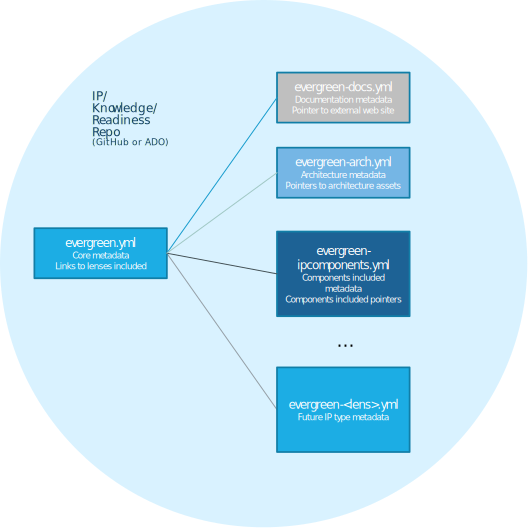

# Getting Started   -  Test

This section provides specific guidance on staring with evergreen delivery IP approaches, showcases how to set up the overall team structure and start adopting more and more lenses as a way of enriching the repository as it grows and needs more rich discovery. It can hopefully allow team adopting evergreen principles to avoid some of the blockers (aka ['evergivens'](https://en.wikipedia.org/wiki/Ever_Given#/media/File:Container_Ship_'Ever_Given'_stuck_in_the_Suez_Canal,_Egypt_-_March_24th,_2021_cropped.jpg)) and ensure less effort needs to be invested to set up well working environment.

## Core
Dev auto trigger

## Core

First thing to start with making your IP work evergreen is to enable the repo to follow the structure and metadata guidance of the Evergreen Delivery IP. It is combination of aggregated best practices to promote innersource contribution model on one hand, it is specific technical/tools guidance also based on best practices gathered from various MCS teams.

This enablement included setting up or attributing the existing Git repos on Azure DevOps or on GitHub Enterprise, it also involves ensuring the correct metadata exists in the repository. And finally - it includes setting up Team site for all the contributors to have informal collaboration and meeting space as well.

For specific guidance on setting up Core evergreen elements for existing or new IP asset being created please see [Core Structure Guidance](core/index.md).

## Content Lenses

Based on teh description of the overall approach section (see [Diverse Delivery IP](../approach/../approach/diverse-delivery-ip.md)) evergreen IP in addition to core element guidance provides guidance for multiple different types of IP being managed.

Each of these are called "content lenses" and provide more guidance on how specific type of content needs to be managed. If Core approach and metadata is a must for all evergreen teams, then the lenses implementation is optional and depends on maturity of the IP and type of IP being managed. Team can decide to use zero or more lenses for their repository. Using lenses make IP repositories more uniform and therefore provide lower barrier of entry to new contributors. For example, using document lens to provide documentation of APIs of the IP being created helps new contributors who have worked on documentation in other evergreen project to start contribution easier in a new project.

Lenses also act as extensibility model for the content management approach allowing over time new lenses being added with specific approaches of how they get managed. The list of currently supported lenses (and the lenses planned) is provided below with links to specific guidance on how to introduce the lens into your IP work. 

If you want to contribute a new lens or request one that would be useful for multiple teams, please contribute your suggestions on [Evergreen Delivery IP forum team](https://teams.microsoft.com/l/channel/19%3a3d51464fa01345f6a79290ac257ead8c%40thread.tacv2/General?groupId=ef3294c6-f026-47a2-842e-1881f6f09272&tenantId=72f988bf-86f1-41af-91ab-2d7cd011db47). Note that even if you do not find the lens you need, you should enable your repo with new lenses as they get added.

List of currently implemented lenses with guidance:

- **[Documentation lens](./documentation-lens/index.md)** - enables teams to add structured documentation and enable documentation publishing site hosted for all MS employees.
- Work in progress: **Reference Architecture lens** - enables teams to document reference architectures in a structured way (leverages documentation lens for publishing the reference architecture).
- Work in progress: **IP Component lens** - enables structured management of IP component supporting materials of [IP component framework](http://aka.ms/components)
- Work in progress: **Readiness lens** - allows structured way of linking readiness materials for the IP from the site and publishing the readiness materials as [Readiness Boards](https://microsoft.sharepoint.com/sites/infopedia/About/Pages/pintolearn.aspx?c=pintolearn06062018)

If you want to present the approach, see this presentation covering the same aspects of the document lens approach and summary of all implemented lenses.

<iframe src="https://microsofteur.sharepoint.com/teams/EvergreenDeliveryIP/_layouts/15/Doc.aspx?sourcedoc={cb3deb19-b608-4cfb-9740-a9b278c9b9cc}&amp;action=embedview&amp;wdAr=1.7777777777777777" width="610px" height="367px" frameborder="0">This is an embedded <a target="_blank" href="https://office.com">Microsoft Office</a> presentation, powered by <a target="_blank" href="https://office.com/webapps">Office</a>.</iframe>

## Describing the IP Assets

The approach for describing the core IP and also all the lenses in it is based on set of linked metadata files. The [main metadata file](./core/evergreen-ip-metadata.md) and zero or more metadata files for specific lenses that IP repository is using.

Illustration of the approach is presented in the image below.

