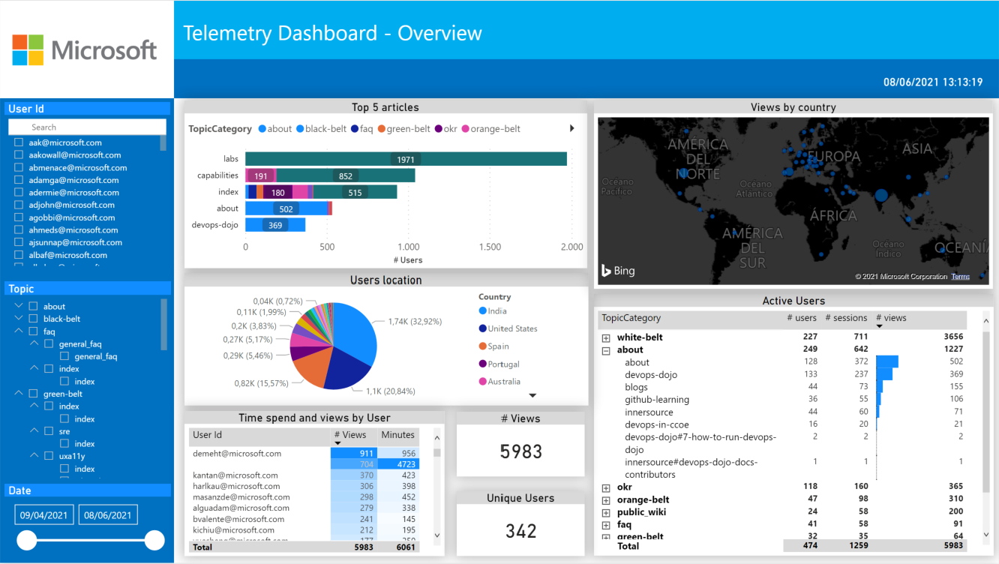
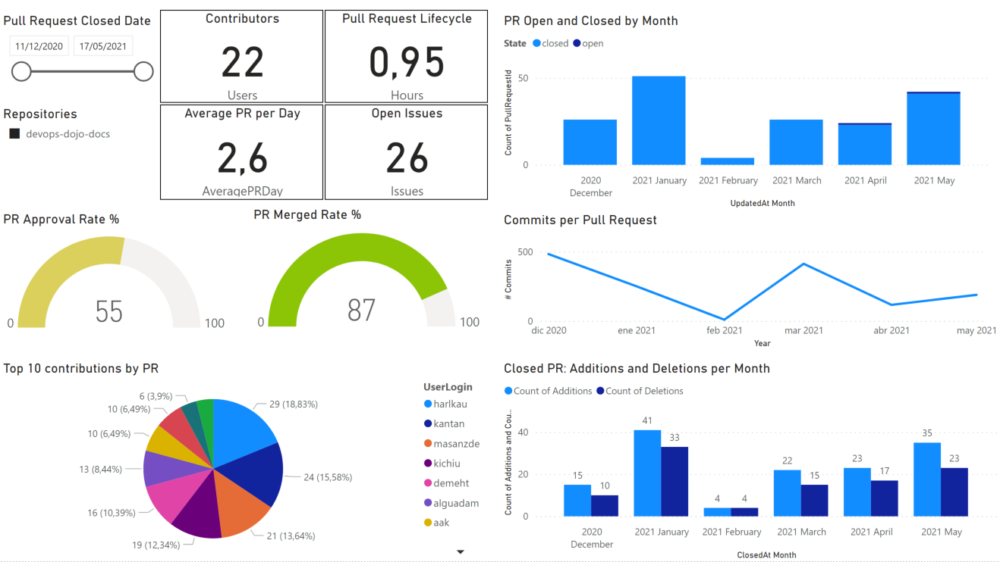
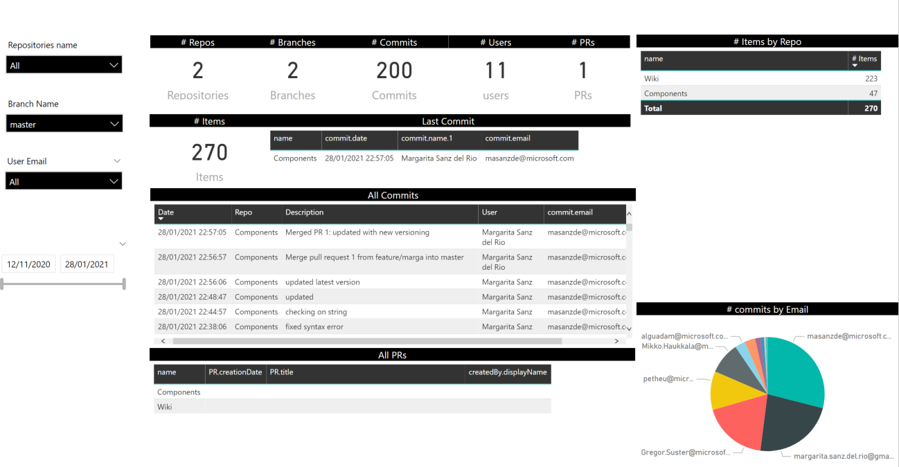

# Power BI suggested templates

As introduced in previous sections, as per evergreen delivery IP guidance is to use the [Power BI tool](https://docs.microsoft.com/en-us/power-bi/fundamentals/power-bi-overview) to build monitoring dashboards. Before starting to explain each of the templates, it is important to know that Power BI consists of several elements that work together, starting with these three basic concepts:

- Windows desktop application called Power BI Desktop.
- Online SaaS (software as a service) service called Power BI service.
- Power BI mobile applications for Windows, iOS and Android devices.

As part of this IP guidance we will only refer to the first two, desktop application and SaaS service. These will be the two services we will use for our monitoring solution.

In other sections we have already discussed the two ambits to consider for monitoring: the consumption and the contribution. To ensure that the dashboards are modular and can easily evolve as new metrics and KPIs are identified, it is proposed to dedicate a dashboard for each type of service. On the other hand, for the contribution type of monitoring, since this IP refers to two types of technologies, GitHub and ADO, both have been differentiated. The reasoning behind is that the data model of each one is not exactly the same. Thus, in the next articles we will find more detailed information about:

> [!NOTE]
> The following templates are built upon a set of metrics selected by the Evergreen delivery IP team based on the experienced with other teams from Microsoft. These KPIs have been identified as the most useful ones when monitoring innersource type of resources. However, they are just guidelines and rails from where teams can increment and customize their solutions according to their specific requirements.

- **Documentation lens consumption insights template**: this template provides a holistic view of the application's consumption. Among its metrics we find important data such as the number of **views**, the number of unique **users**, the **most consumed articles** or the average **time that each user spends** on each article.

> [!WARNING]
> The following two templates are still under development. We stimate to have them available by the end of Q1FY22. The following images are just POCs and sketchs of the content of these dashboards that may be updated in the upcoming months.

- **GitHub contribution insights template**: a GitHub flavored type of template for those repositories that are hosted by GitHub. KPIs of this dashboard include total number of **contributors**, amounts of **additions and deletions** by month, **Pull Requests lifecycle**, etc.

- **Azure DevOps contribution insights template**: an Azure DevOps flavored type of template for those repositories that are hosted by ADO. This template takes advantage of the Continuous Planning capabilities implemented in ADO to give a more broad overview of the contributions and planned work. 

> [!NOTE]
> Everything in these templates can be customized as per wanted. Backgrounds, field names, field formats and more can be adapted to the requirements and needs of your specific scenario.

### What's next?

Start implementing your documentation lensed dashboard by following the instructions in [Documentation lens insights template](documentation-lens-insights-template.md) section.