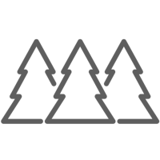
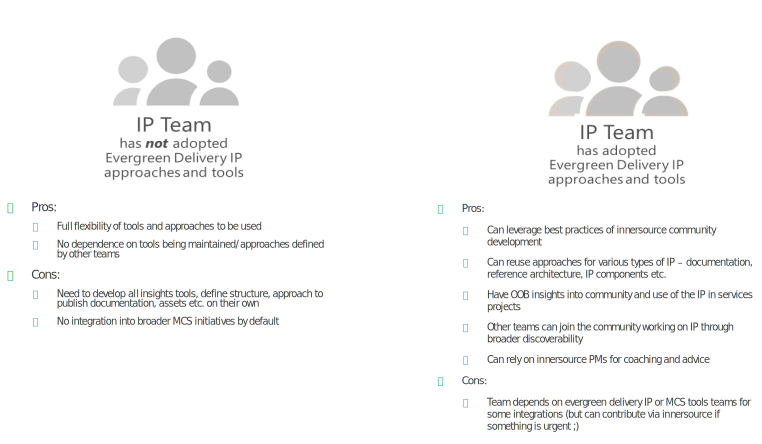
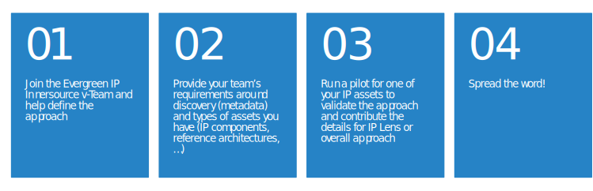

# Evergreen Delivery IP - Testing now by QA Team

Evergreen Delivery IP is ACAI CTO driven program to improve the way CTO and field teams are finding, reusing, becoming contributors and leading evolution of managed and community IP.

## About the Initiative

To find more on the initiative itself, directions of change and short term objective, broader goals, please see [Initiative section](initiative/index.md). This section also includes information on how to contribute, provide feedback, join the team that is working in and promoting [innersource](https://innersourcecommons.org/learn/learning-path/) way of collaborating.

## Approach

The general suggested approach of how ACAI delivery teams should manage the IP efforts going forward is defined in [Approach section](approach/index.md). The main aspects that the approach is touching to achieve goals of better discoverability, more grassroots involvement and more uniform general approach managing IP are:

- [team model](approach/team-model.md) that is based on the [innersource](resources/innersource.md) approach
- [modular ip asset management](approach/diverse-delivery-ip.md) that should support diverse teams working on different set of IP assets (documentation, reference architecture, data models, scripts, code and components)
- [sustaining and growing ip contribution culture](approach/contribution-culture/contribution-culture.md) that includes approaches suggested as part of the program to ensure contribution moves from current spots of IP contribution successes to more pervasive focus on IP contribution all up in ACAI.

## Guidance

If [Approach section](approach/index.md) defines the "architecture" of the evergreen delivery IP development, management and sustained evolution, then [Guidance section](guidance/index.md) goes into the detailed supporting information and tools to ensure other evergreen delivery teams that want to adopt these approaches have starter kits and learning materials that ensure this is simpler than doing from scratch.

Start adoption of Evergreen approaches by reading [Getting started...](guidance/index.md). The beauty is that you can start small and 'enrich' your repo and Teams sites to the extent you really need/want.

## Benefits for Adopting

Expected benefits from adopting the evergreen IP approaches for field IP teams and SAO teams tasked with development/capturing of IP assets are:

- reusing best practices of contribution management via Teams and Git/ADO repositories,
- leveraging existing tools and guidance to remove barriers, get better results of IP management faster, and insights to focus on what is important,
- getting broader field visibility into IP being implemented through integration with MCS wide tools - Chrysalis, SEE, Campus,
- having data based insights to support growth of community and IP elements

## Contributing

Given this Evergreen Delivery IP guidance/approach definition initiative itself is running using innersource approaches, any contributor is welcome and contributions to the approach can be various - starting from learning about the initiative itself, promoting it, moving to following the guidance and starting to build your own IP leveraging evergreen delivery IP tools, suggesting new approaches/guidance, providing feedback and becoming active contributor to the approach itself.

Resources:

- this web site describing the overall approach and guidance
- [Evergreen Delivery IP Forum team](https://teams.microsoft.com/l/team/19%3a3d51464fa01345f6a79290ac257ead8c%40thread.tacv2/conversations?groupId=ef3294c6-f026-47a2-842e-1881f6f09272&tenantId=72f988bf-86f1-41af-91ab-2d7cd011db47)
- [Repository](https://dev.azure.com/evergreen-delivery-ip/docs) containing guidance and tools for easier implementation of Evergreen Delivery
